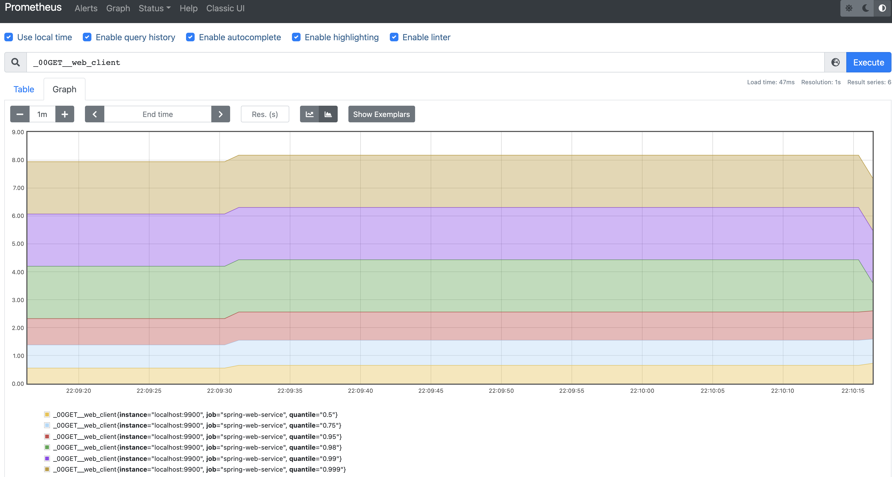

# EaseAgent
An agent component for Java system.

- [EaseAgent](#easeagent)
  - [Overview](#overview)
    - [Purpose](#purpose)
    - [Principles](#principles)
  - [Features](#features)
  - [Architecture Diagram](#architecture-diagram)
      - [Description](#description)
  - [QuickStart](#quickstart)
    - [Download](#download)
    - [Build From Source](#build-from-source)
    - [1. Get Configuration file](#1-get-configuration-file)
    - [2. Modify Configuration](#2-modify-configuration)
    - [3. Building the demo application and simple plugin.](#3-building-the-demo-application-and-simple-plugin)
    - [4. Copy simple plugin to `plugins` directory](#4-copy-simple-plugin-to-plugins-directory)
    - [5. Run the demo application with EaseAgent.](#5-run-the-demo-application-with-easeagent)
    - [6. Integrate with Prometheus](#6-integrate-with-prometheus)
    - [7. Test Data](#7-test-data)
  - [User Manual](#user-manual)
  - [Plugin Development Guide](#plugin-development-guide)
  - [Licenses](#licenses)

## Overview
- Easeagent is the underlying component that provides non-intrusive extensions to applications of the Java ecosystem.
- Non-intrusive application extensions currently include data collection, such as tracing, metric and log collection in the APM application domain; it also includes control-panel extensions, such as redirection plugins, to provide the ability of dynamically modify configuration of the connecting back-end for supporting special scenarios, such as online stress testing in the production environment.
- In addition, users can extend Easeagent in the form of plugins to support the non-intrusive needs of user-specific scenarios.

### Purpose
- EaseAgent can be a Java agent for APM(Application Performance Management) system.
- EaseAgent collects the basic metrics and the service tracing logs, which is very helpful for performance analysis and troubleshooting.
- EaseAgent is compatible with mainstream monitoring ecosystems, such as Kafka, ElasticSearch, Prometheus, Zipkin, etc.
- EaseAgent majorly focuses on the Spring Boot development environments, but users can support any Java ecosystem applications through plugins.
- Easeagent can support scenario-specific business requirements through the plugin mechanism, such as traffic redirection, traffic coloring, etc.

### Principles
- Safe to Java application/service.
- Instrumenting a Java application in a non-intrusive way.
- Lightweight and very low CPU, memory, and I/O resource usage.
- Highly extensible, users can easily do extension through a simple and clear plugin interface.
- Design for Micro-Service architecture, collecting the data from a service perspective.

## Features
* Easy to use. It is right out of the box for Metirc, Tracing and Logging collecting.
    * Collecting Metric & Tracing Logs.
        * `JDBC 4.0`
        * `HTTP Servlet`、`HTTP Filter`
        * `Spring Boot 2.2.x`: `WebClient` 、 `RestTemplate`、`FeignClient`
        * `RabbitMQ Client 5.x`、 `Kafka Client 2.4.x`
        * `Jedis 3.5.x`、 `Lettuce 5.3.x`
    * Collecting Access Logs.
        * `HTTP Servlet`、`HTTP Filter`
        * `Spring Cloud Gateway`
    * Instrumenting the `traceId` and `spanId` into user application logging automatically
    * Supplying the `health check` endpoint
    * Supplying the `readiness check` endpoint for `SpringBoot2.2.x`

* Easy to Extend
    * Simple and clear Plugin Interface, creating a plugin as few as three classes.
    * Extremely cleanly packaged `Tracing` and `Metric` API, with a small amount of code to achieve business support.

* Standardization
    * The tracing data format is fully compatible with the zipkin data format.
    * Metric data format fully supports integration with Prometheus.


## Architecture Diagram


#### Description
**Plugin Framework** in `core` module is base on [Byte buddy](https://github.com/raphw/byte-buddy) technology.

1. Easeagent's plugin defines where (which classes and methods) to make enhancements by Points implementation and what to do at the point of enhancement by the implementations of Interceptor.
2. When the program invokes the enhanced method of class defined by Points, the `unique index`(uid) owned by the method will be used as a parameter to call the common interface of `Agent Common Method Advice`, which finds the `Agent Interceptor Chain` by the `Unique Index` and calls the `before` method of each Interceptor in the chain in order of priority.
3. Normally, both the `Metric Interceptor` and the `Tracing Interceptor` are in the agent interceptor chain and are called sequentially.
4. According to call the `Metric API` and `Tracing API` in interceptors, the `Metric` and `Tracing` information will be stored in `MetricRegistry` and `Tracing`.
5. The `Reporter` module will get information from `MetricRegistry` and `Tracing` and send it to `Kafka`.
6. The `after` method of each interceptor in the `Agent Interceptor Chain` will be invoked in the reverse order of the `before` invoked at last.
7. The `tracing` data can be send to `kafka` server or `zipkin` server, the `metric` data can be send to `kafka` server and pull by `Prometheus` server.

## QuickStart

### Download
Download `easeagent.jar` from releases [releases](https://github.com/megaease/easeagent/releases).

or

```
$ curl -Lk https://github.com/megaease/easeagent/releases/download/{tag}/easeagent.jar -O
```

### Build From Source
Download EaseAgent with `git clone https://github.com/megaease/easeagent.git`.
```
$ cd easeagent
$ mvn clean package 
```
The `./build/target/easeagent-dep.jar` is the agent jar with all the dependencies.

> Windows platform user please make sure git `core.autocrlf` is set to false before git clone.
> You can use `git config --global core.autocrlf false` to modify `core.autocrlf`.

### 1. Get Configuration file
Extracting the default configuration file.
```
$ jar xf easeagent.jar agent.properties easeagent-log4j2.xml
```

### 2. Modify Configuration
* Modify service name, default configuration is `demo-service`.
```
name=[app-name]
```
* Modify kafka server config, default configuration is `127.0.0.1:9092`.
Both `tracing` data and `metric` data will be send to kafka server by default configuration.
```
observability.outputServer.bootstrapServer = [ip:port]
```

* Modify output configuration, if you want to watch log information in console.
```
# metric output
observability.metrics.[xxxx].appendType=console

# tracings output to console
observability.tracings.output.target=system
observability.tracings.output.enabled=false
```
If you want to watch tracing information only in console, comment out the outputServer configuration and set target to 'system':
```
# observability.outputServer.bootstrapServer=127.0.0.1:9092
# observability.outputServer.timeout=10000
# observability.outputServer.enabled=true

observability.tracings.output.target=system

```

* Sending tracing data to zipkin server
```
# [zipkin]: send data to zipkin server
# [system]: send data to kafka
observability.tracings.output.target=zipkin
observability.tracings.output.target.zipkinUrl=http://localhost:9411/api/v2/spans
```

### 3. Building the demo application and simple plugin.
```
$ git clone https://github.com/megaease/easeagent-test-demo.git
$ cd spring-web
$ mvn clean package

$ cd simple-plugin
$ mvn clean package
```
There is an agent.properties configuration file in the demo directory, which is configured to print all information to the console.
If you want to print all information to console, then you can use this configuration file.

### 4. Copy simple plugin to `plugins` directory
There is a [simple plugin](https://github.com/megaease/easeagent-test-demo/tree/master/simple-plugin) which only for demonstrating the use of the plugin. 
The compiled simple plugin JAR package should be copy to the `plugins` directory located in `EASE_AGENT_PATH`, and if the directory is not exsist, it need to be created.

```
$ export EASE_AGENT_PATH=[Replace with agent path]
cp target/simple-plugin-1.0.jar $EASE_AGENT_PATH/plugins/

```

### 5. Run the demo application with EaseAgent.
```
# Open another console
$ export EASE_AGENT_PATH=[Replace with agent path]
$ java "-javaagent:${EASE_AGENT_PATH}/easeagent-dep.jar=${EASE_AGENT_PATH}/agent.properties" -Deaseagent.server.port=9900 -jar target/spring-web-1.0.jar

```

### 6. Integrate with Prometheus
Adding the following configuration in `prometheus.yml`
```
  - job_name: 'spring-web-service'
    static_configs:
      - targets: ['localhost:9900']
    metrics_path: "/prometheus/metrics"

```
Start Prometheus
```
$ ./prometheus --config.file=prometheus.yml

# Open another console, run curl to access the test url for several times.
$ curl -v http://127.0.0.1:18888/web_client

```

### 7. Test Data
* Tracing  
If the tracing data is send to console, there would be some tracing log in console like this:
```
[{"traceId":"5a8800b902703307","parentId":"84c4cba42fb92788","id":"fd00a1705c88cbb2","kind":"SERVER","name":"get","timestamp":1639493283759877,"duration":217545,"shared":true,"localEndpoint":{"serviceName":"demo-service","ipv4":"192.168.0.102"},"remoteEndpoint":{"ipv4":"127.0.0.1","port":55809},"tags":{"http.method":"GET","http.path":"/hello","http.route":"/hello","i":"ServerName.local"},"type":"log-tracing","service":"demo-service","system":"demo-system"},{"traceId":"5a8800b902703307","id":"5a8800b902703307","kind":"SERVER","name":"get","timestamp":1639493283753466,"duration":228827,"localEndpoint":{"serviceName":"demo-service","ipv4":"192.168.0.102"},"remoteEndpoint":{"ipv4":"127.0.0.1","port":55851},"tags":{"http.method":"GET","http.path":"/web_client","i":"ServerName.local"},"type":"log-tracing","service":"demo-service","system":"demo-system"}]

...

```
* Metric  
Open Browser to visit [http://localhost:9090](http://localhost:9090).

After visit more pages, open Prometheus manager [http://localhost:9090](http://localhost:9090), and search `_00GET__web_client`. You will see as following.



## User Manual
For more information, please refer to the [User Manual](./doc/user-manual.md).

## Plugin Development Guide
Refer to [Plugin Development Guide](./doc/development-guide.md).

## Licenses
EaseAgent is licensed under the Apache License, Version 2.0. See [LICENSE](./LICENSE) for the full license text.
