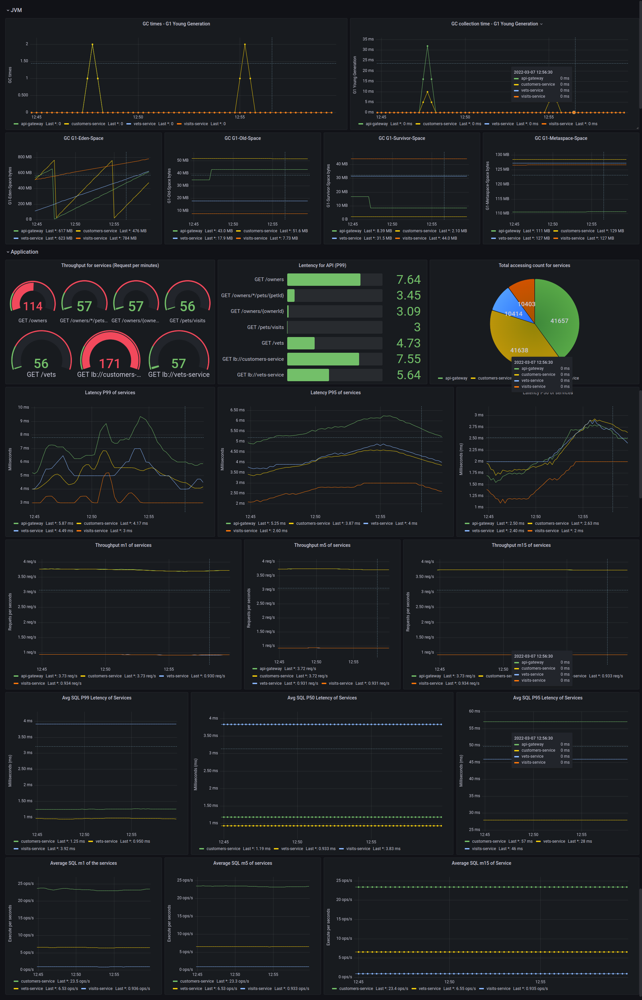
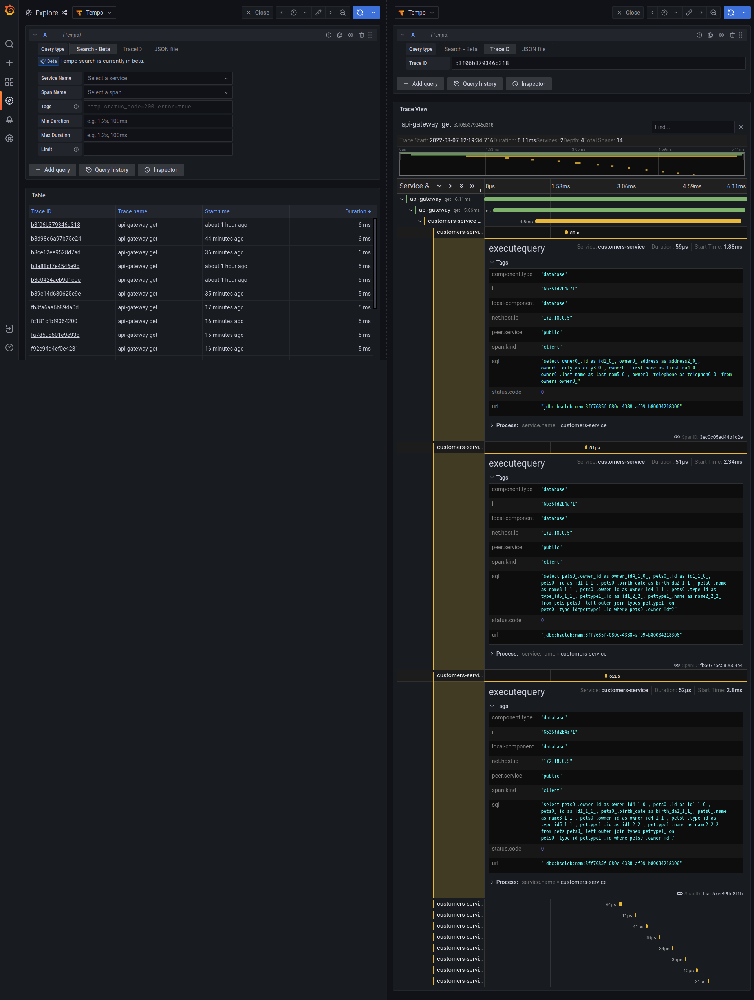

# EaseAgent

A lightweight & opening Java Agent for Cloud-Native and APM system

- [EaseAgent](#easeagent)
  - [Overview](#overview)
    - [Purpose](#purpose)
    - [Principles](#principles)
  - [Features](#features)
  - [Architecture Diagram](#architecture-diagram)
      - [Description](#description)
  - [QuickStart](#quickstart)
    - [Get And Set Environment Variable](#get-and-set-environment-variable)
      - [Setup Environment Variable](#setup-environment-variable)
      - [Download](#download)
      - [Build From the Source](#build-from-the-source)
      - [Get Configuration file](#get-configuration-file)
    - [Monitor Spring Petclinic](#monitor-spring-petclinic)
      - [Prerequisites](#prerequisites)
      - [Initialize and Start the project](#initialize-and-start-the-project)
      - [Metric](#metric)
      - [Tracing](#tracing)
      - [Build Spring Petclinic](#build-spring-petclinic)
    - [Add an Enhancement Plugin](#add-an-enhancement-plugin)
  - [User Manual](#user-manual)
  - [Enhancement Plugin Development Guide](#enhancement-plugin-development-guide)
  - [Report Plugin Development Guide](#report-plugin-development-guide)
  - [Community](#community)
  - [Licenses](#licenses)

## Overview
- EaseAgent is the underlying component that provides non-intrusive extensions to applications of the Java ecosystem. 
- EaseAgent can collect distributed application tracing, metrics, and logs, which could be used in the APM system and improve the observability of a distributed system. for the tracing, EaseAgent follows the [Google Dapper](https://research.google/pubs/pub36356/) paper.
- EaseAgent also can work with Cloud-Native architecture. For example, it can help Service Mesh (especially for [EaseMesh](https://github.com/megaease/easemesh/) ) to do some control panel work.
- EaseAgent supports plugins mechanism development, which is easy to extend or add new functionality.

### Purpose
- EaseAgent can be a Java agent for APM(Application Performance Management) system.
- EaseAgent collects the basic metrics and the service tracing logs, which is very helpful for performance analysis and troubleshooting.
- EaseAgent is compatible with mainstream monitoring ecosystems, such as Kafka, ElasticSearch, Prometheus, Zipkin, etc.
- EaseAgent majorly focuses on the Spring Boot development environments, but users can support any Java ecosystem applications through plugins.
- EaseAgent can support scenario-specific business requirements through the plugin mechanism, such as traffic redirection, traffic coloring, etc.

### Principles
- Safe to Java application/service.
- Instrumenting a Java application in a non-intrusive way.
- Lightweight and very low CPU, memory, and I/O resource usage.
- Highly extensible, users can easily do extensions through a simple and clear plugin interface.
- Design for Micro-Service architecture, collecting the data from a service perspective.

## Features
* Easy to use. It is right out of the box for Metrics, Tracing and Logs collecting.
    * Collecting Metric & Tracing Logs.
        * `JDBC 4.0`
        * `HTTP Servlet`、`HTTP Filter`
        * `Spring Boot 2.2.x`: `WebClient` 、 `RestTemplate`、`FeignClient`
        * `RabbitMQ Client 5.x`、 `Kafka Client 2.4.x`
        * `Jedis 3.5.x`、 `Lettuce 5.3.x (sync、async)`
        * `ElasticSearch Client >= 7.x (sync、async)`
        * `Mongodb Client >=4.0.x (sync、async)`
    * Collecting Access Logs.
        * `HTTP Servlet`、`HTTP Filter`
        * `Spring Cloud Gateway`
    * Instrumenting the `traceId` and `spanId` into user application logging automatically
    * Supplying the `health check` endpoint
    * Supplying the `readiness check` endpoint for `SpringBoot2.2.x`
    * Supplying the `agent info` endpoint
    
*  Data Reports
    * Console Reporter.
    * Prometheus Exports.
    * Http Reporter.
    * Kafka Reporter.
    * Custom Reporter.

* Easy to Extend
    * Simple and clear Plugin Interface, creating a plugin as few as three classes.
    * Extremely cleanly packaged `Tracing` and `Metric` API, with a small amount of code to achieve business support.

* Standardization
    * The tracing data format is fully compatible with the Zipkin data format.
    * Metric data format fully supports integration with `Prometheus`.
    * The application log format is fully compatible with the `Opentelemetry` data format.


## Architecture Diagram


#### Description
**Plugin Framework** in `core` module is base on [Byte buddy](https://github.com/raphw/byte-buddy) technology.

1. Easeagent's plugin defines where (which classes and methods) to make enhancements by implementing the `Points`  and what to do at the point of enhancement by implementing the `Interceptor`.
2. When the program invokes the enhanced method of class defined by Points, the `unique index`(uid) owned by the method will be used as a parameter to call the common interface of `Agent Common Method Advice`, which finds the `Agent Interceptor Chain` by the `Unique Index` and calls the `before` method of each Interceptor in the chain in order of priority.
3. Normally, both the `Metric Interceptor` and the `Tracing Interceptor` are in the agent interceptor chain and are called sequentially.
4. According to call the `Metric API` and `Tracing API` in interceptors, the `Metric` and `Tracing` information will be stored in `MetricRegistry` and `Tracing`.
5. The `Reporter` module will get information from `MetricRegistry` and `Tracing` and send it to `Kafka`.
6. The `after` method of each interceptor in the `Agent Interceptor Chain` will be invoked in the reverse order of the `before` invoked at last.
7. The `tracing` data can be sent to `kafka` server or `zipkin` server, the `metric` data can be sent to `kafka` server and pull by `Prometheus` server.

## QuickStart

### Get And Set Environment Variable

Setup Environment Variable and then download the latest release of `easeagent.jar` or build it from the source.

#### Setup Environment Variable
```
$ cd ~/easeagent #[Replace with agent path]
$ export EASE_AGENT_PATH=`pwd` # export EASE_AGENT_PATH=[Replace with agent path]
$ mkdir plugins
```

#### Download
Download `easeagent.jar` from releases [releases](https://github.com/megaease/easeagent/releases).

```
$ curl -Lk https://github.com/megaease/easeagent/releases/latest/download/easeagent.jar -O
```

#### Build From the Source

You need Java 1.8+ and git:

Download EaseAgent with `git clone https://github.com/megaease/easeagent.git`.
```
$ cd easeagent
$ mvn clean package -Dmaven.test.skip
$ cp ./build/target/easeagent-dep.jar $EASE_AGENT_PATH/easeagent.jar
```
The `./build/target/easeagent-dep.jar` is the agent jar with all the dependencies.

> For the Windows platform, please make sure git `core.autocrlf` is set to false before git clone.
> You can use `git config --global core.autocrlf false` to modify `core.autocrlf`.

[How to use easeagent.jar on host?](doc/how-to-use/use-on-host.md)

[How to use easeagent.jar in docker?](doc/how-to-use/use-in-docker.md)

#### Get Configuration file
Extracting the default configuration file.
```
$ cd $EASE_AGENT_PATH
$ jar xf easeagent.jar agent.properties easeagent-log4j2.xml
```

By default, there is an agent.properties configuration file, which is configured to print all output data to the console.

### Monitor Spring Petclinic
#### Prerequisites
- Make sure you have installed the docker, docker-compose in your environment.
- Make sure your docker version is higher than v19.+.
- Make sure your docker-compose version is higher than v2.+.

[Project Details](https://github.com/megaease/easeagent-spring-petclinic)

#### Initialize and Start the project
```
$ git clone https://github.com/megaease/easeagent-spring-petclinic.git
$ cd easeagent-spring-petclinic
$ git submodule update --init
$ ./spring-petclinic.sh start
```

> The script will download the latest release of EaseAgent. 
> If you want to use your own built EaseAgent, copy it to the directory: `easeagent/downloaded`
>> ```$ cp $EASE_AGENT_PATH/easeagent.jar  easeagent/downloaded/easeagent-latest.jar``` 

It requires `Docker` to pull images from the docker hub, be patient. 

Open Browser to visit grafana UI: [http://localhost:3000](http://localhost:3000).

#### Metric
Click the `search dashboards`, the first icon in the left menu bar. Choose the `spring-petclinic-easeagent` to open the dashboard we prepare for you.

Prometheus Metric Schedule: [Prometheus Metric](doc/prometheus-metric-schedule.md)



#### Tracing

If you want to check the tracing-data, you could click the explore in the left menu bar. Click the Search - beta to switch search mode. Click search query button in the right up corner, there is a list containing many tracing. Choose one to click.



#### Build Spring Petclinic

[Spring Petclinic Demo](doc/spring-petclinic-demo.md)

### Add an Enhancement Plugin
[Add a Demo Plugin to EaseAgent](doc/add-plugin-demo.md)

## User Manual
For more information, please refer to the [User Manual](./doc/user-manual.md).

## Enhancement Plugin Development Guide
Refer to [Plugin Development Guide](./doc/development-guide.md).

## Report Plugin Development Guide
Report plugin enables user report tracing/metric data to different kinds of the backend in a different format.

Refer to [Report Plugin Development Guide](./doc/report-development-guide.md)

## Community

* [Github Issues](https://github.com/megaease/easeagent/issues)
* [Join Slack Workspace](https://join.slack.com/t/openmegaease/shared_invite/zt-upo7v306-lYPHvVwKnvwlqR0Zl2vveA) for requirement, issue and development.
* [MegaEase on Twitter](https://twitter.com/megaease)

If you have any questions, welcome to discuss them in our community. Welcome to join!


## Licenses
EaseAgent is licensed under the Apache License, Version 2.0. See [LICENSE](./LICENSE) for the full license text.
