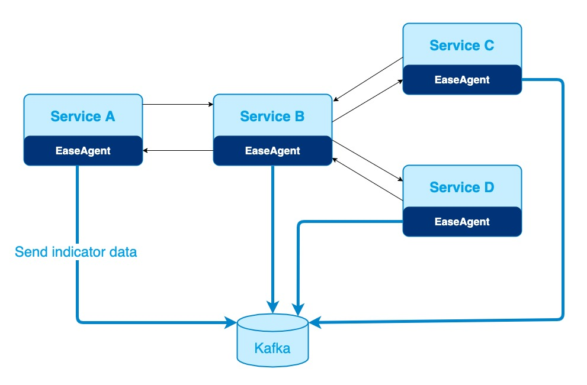

# EaseAgent
An agent component for Java system.

- [Overview](#Overview)
  - [Purpose](#Purpose)
  - [Principles](#Principles)
  - [Architecture Diagram](#Architecture-Diagram)
- [Features](#Features)
- [QuickStart](#QuickStart)
  - [Download](#Download)
  - [Build From Source](#Build-From-Source)
- [User Manual](#User-Manual)
- [Development Guide](#Development-Guide)  
- [Licenses](#Licenses)

## Overview

### Purpose
- EaseAgent is a Java agent for APM(Application Performance Management) system.
- EaseAgent majorly  focuses on the Spring Boot development environments.
- EaseAgent is compatible with mainstream monitoring ecosystems, such as Kafka, ElasticSearch, Prometheus, Zipkin, etc.
- EaseAgent collects the basic metrics and the service tracking logs, which is very helpful for performance analysis and troubleshooting.

### Principles
- Design for Micro-Service architecture, collecting the data from a service perspective.
- Instrumenting a Java application in a non-intrusive way.
- Lightweight and very low CPU, memory, and I/O resource usage.
- Safe to Java application/service.

### Architecture Diagram


#### Description
Instrumenting the method base on [Byte buddy](https://github.com/raphw/byte-buddy) technology.
```
net.bytebuddy.asm.Advice.OnMethodEnter, net.bytebuddy.asm.Advice.OnMethodExit
```
1. When the program invokes the enhanced method of class, the method which has the annotation (`OnMethodEnter`)  will be invoked at first.
2. `Method Advice` will invoke `Metric Interceptor` and `Tracing Interceptor` to processing.
3. `Metric` and `Tracing` information will be stored in `MetricRegistry` and `Tracing`.
4. The `Reporter` module will get information from `MetricRegistry` and `Tracing` and send it to `Kafka`. 
5. The method  which has the annotation (`OnMethodExit`) will be invoked at last.

## Features
* Collecting Metric & Tracing Logs.
    * `JDBC 4.0`
    * `HTTP Servlet`、`HTTP Filter`
    * `Spring Boot 2.2.x`: `WebClient` 、 `RestTemplate`、`FeignClient` 
    * `RabbitMQ Client 5.x`、 `Kafka Client 2.4.x`
    * `Jedis 3.5.x`、 `Lettuce 5.3.x` 
* Collecting Access Logs.
    * `HTTP Servlet`、`HTTP Filter`
    * `Spring Cloud Gateway`
* Instrumenting the `traceId` and `spanId` automatically
* Supplying the `health check` endpoint
* Supplying the `readiness check` endpoint for `SpringBoot2.2.x`

## QuickStart

### Download
Download `easeagent.jar` from releases [releases](https://github.com/megaease/easeagent/releases).

or

```
$ curl -Lk https://github.com/megaease/easeagent/releases/download/{tag}/easeagent.jar -O
```

### Build From Source
Download EaseAgent with `git clone https://github.com/megaease/easeagent.git`.
```
$ cd easeagent
$ mvn clean package -am -pl build
```
The `./build/target/easeagent-dep.jar` is the agent jar with all the dependencies.

### Step 1
Extracting the default configuration file.
```
$ jar xf easeagent.jar agent.properties log4j2.xml
```

### Step 2
* Modify service name, default configuration is unknown-service.
```
name=[app-name]
```
* Modify kafka server config, default configuration is `127.0.0.1:9092`.
```
observability.outputServer.bootstrapServer = [ip:port]
```
* Modify output configuration, if you want to see log information in console.
```
# metric output
observability.metrics.[xxxx].appendType=console

# tracings output
observability.tracings.output.enabled=false
```

### Step 3
Building the demo application.
```
$ git clone https://github.com/akwei/spring-petclinic-microservices.git
$ cd spring-petclinic-microservices
$ mvn -DskipTests=true package
```

### Step 4
Run the demo application with EaseAgent.
```
# Open another console
$ java -jar spring-petclinic-config-server/target/spring-petclinic-config-server-2.4.2.jar

# Open another console
$ java -jar spring-petclinic-discovery-server/target/spring-petclinic-discovery-server-2.4.2.jar

# Open another console
$ export EASE_AGENT_PATH=[Replace with agent path]
$ java "-javaagent:${EASE_AGENT_PATH}/easeagent-dep.jar=${EASE_AGENT_PATH}/agent.properties" -Deaseagent.server.port=9900 -jar spring-petclinic-vets-service/target/spring-petclinic-vets-service-2.4.2.jar

# Open another console
$ export EASE_AGENT_PATH=[Replace with agent path]
$ java "-javaagent:${EASE_AGENT_PATH}/easeagent-dep.jar=${EASE_AGENT_PATH}/agent.properties" -Deaseagent.server.port=9901 -jar spring-petclinic-visits-service/target/spring-petclinic-visits-service-2.4.2.jar

# Open another console
$ export EASE_AGENT_PATH=/[Replace with agent path]
$ java "-javaagent:${EASE_AGENT_PATH}/easeagent-dep.jar=${EASE_AGENT_PATH}/agent.properties" -Deaseagent.server.port=9902 -jar spring-petclinic-customers-service/target/spring-petclinic-customers-service-2.4.2.jar

# Open another console
$ export EASE_AGENT_PATH=[Replace with agent path]
$ java "-javaagent:${EASE_AGENT_PATH}/easeagent-dep.jar=${EASE_AGENT_PATH}/agent.properties" -Deaseagent.server.port=9903 -jar spring-petclinic-api-gateway/target/spring-petclinic-api-gateway-2.4.2.jar

```

### Step 5
Adding the following configuration in `prometheus.yml` 
```
  - job_name: 'petclinic-vets-service'
    static_configs:
    - targets: ['localhost:9900']
    metrics_path: "/prometheus/metrics"

  - job_name: 'petclinic-visits-service'
    static_configs:
    - targets: ['localhost:9901']
    metrics_path: "/prometheus/metrics"

  - job_name: 'petclinic-customers-service'
    static_configs:
    - targets: ['localhost:9902']
    metrics_path: "/prometheus/metrics"

  - job_name: 'petclinic-api-gateway'
    static_configs:
    - targets: ['localhost:9903']
    metrics_path: "/prometheus/metrics"

```
Start Prometheus
```
$ ./prometheus --config.file=prometheus.yml
```

### Step 6
Open Browser to visit [http://localhost:8080](http://localhost:8080).

After visit more pages, open Prometheus manager [http://localhost:9090](http://localhost:9090), and search `_00GET__owners`. You will see as following.


## User Manual
For more information, please refer to the [User Manual](./doc/user-manual.md).

## Development Guide
Refer to [Development-Guide](./doc/development-guide.md).

## Licenses
EaseAgent is licensed under the Apache License, Version 2.0. See [LICENSE](./LICENSE) for the full license text.
