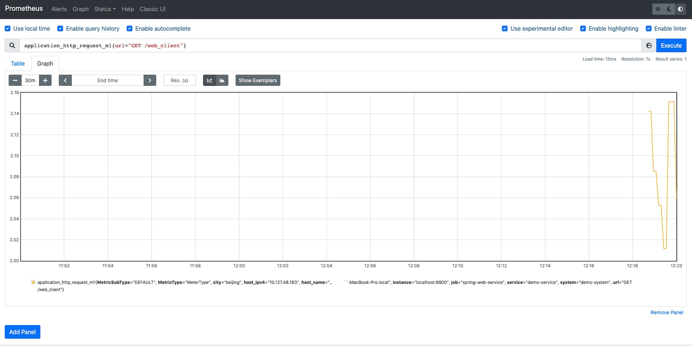

# Simple Demo

You need Java 1.8+ and easeagent:

If you don't already have easeagent, get it and set $EASE_AGENT_PATH: [EaseAgent](../README.md#get-and-set-environment-variable)

## 1. Building the application.
There is a [demo](https://github.com/megaease/easeagent-test-demo) which is spring web and client
```
$ git clone https://github.com/megaease/easeagent-test-demo.git
$ cd spring-web
$ mvn clean package
```

## 2. Building and copy the plugin.
There is a [simple plugin](https://github.com/megaease/easeagent-test-demo/tree/master/simple-plugin) which only for demonstrating the use of the plugin.
 
The compiled simple plugin JAR package should be copy to the `plugins` directory located in `EASE_AGENT_PATH`, and if the directory is not exsist, it need to be created.
```
$ cd simple-plugin
$ mvn clean package
$ cp target/simple-plugin-1.0.jar $EASE_AGENT_PATH/plugins/
```

## 3. Run the demo application with EaseAgent.
```
# Open another console
$ export EASE_AGENT_PATH=[Replace with agent path]
$ java "-javaagent:${EASE_AGENT_PATH}/easeagent-dep.jar" -Deaseagent.config.path=${EASE_AGENT_PATH}/agent.properties -Deaseagent.server.port=9900 -jar target/spring-web-1.0.jar

```

Open another console, run curl to access the test url for several times.

```
$ for i in {1..1000}; do curl -v http://127.0.0.1:18888/web_client;sleep 0.1; done
```

## 4. How to verify it？

### * Tracing
  
If the tracing data is send to console, there would be some tracing log in console like this:
```
[{"traceId":"5a8800b902703307","parentId":"84c4cba42fb92788","id":"fd00a1705c88cbb2","kind":"SERVER","name":"get","timestamp":1639493283759877,"duration":217545,"shared":true,"localEndpoint":{"serviceName":"demo-service","ipv4":"192.168.0.102"},"remoteEndpoint":{"ipv4":"127.0.0.1","port":55809},"tags":{"http.method":"GET","http.path":"/hello","http.route":"/hello","i":"ServerName.local"},"type":"log-tracing","service":"demo-service","system":"demo-system"},{"traceId":"5a8800b902703307","id":"5a8800b902703307","kind":"SERVER","name":"get","timestamp":1639493283753466,"duration":228827,"localEndpoint":{"serviceName":"demo-service","ipv4":"192.168.0.102"},"remoteEndpoint":{"ipv4":"127.0.0.1","port":55851},"tags":{"http.method":"GET","http.path":"/web_client","i":"ServerName.local"},"type":"log-tracing","service":"demo-service","system":"demo-system"}]
...
```

### * Metric

#### Integrate with Prometheus

Adding the following configuration in `prometheus.yml`
```yaml
  - job_name: 'spring-web-service'
    static_configs:
      - targets: ['localhost:9900']
    metrics_path: "/prometheus/metrics"
```

Start Prometheus
```bash
$ ./prometheus --config.file=prometheus.yml
```

Open Browser to visit [http://localhost:9090](http://localhost:9090).

Prometheus Metric Schedule: [Prometheus Metric](./prometheus-metric-schedule.md)

search `application_http_request_m1{url="GET /web_client"}`. You will see as following.



## Configuration

* Modify service name, default configuration is `demo-service`.
```
name=[app-name]
```
* Modify kafka server config, default configuration is `127.0.0.1:9092`.
Both `tracing` data and `metric` data will be send to kafka server by default configuration.
```
#reporter.outputServer.bootstrapServer=[ip:port]
```

* Modify output configuration, if you want to watch log information in console.
```
# metric output
plugin.observability.global.metric.appendType=console

# tracings output to console
reporter.tracing.sender.appendType=console
```

* Sending tracing data to zipkin server
```
# [zipkin]: send data to zipkin server
# [system]: send data to kafka
reporter.tracing.sender.appendType=http
reporter.tracing.sender.url=http://localhost:9411/api/v2/spans
```
