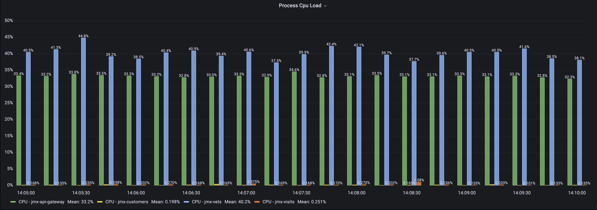
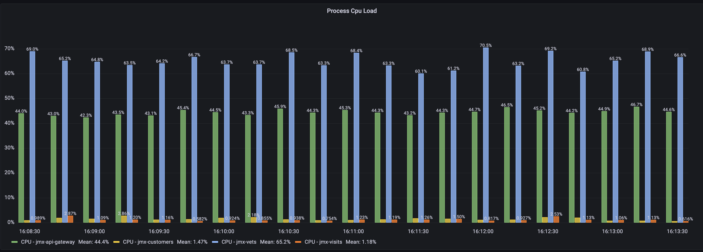
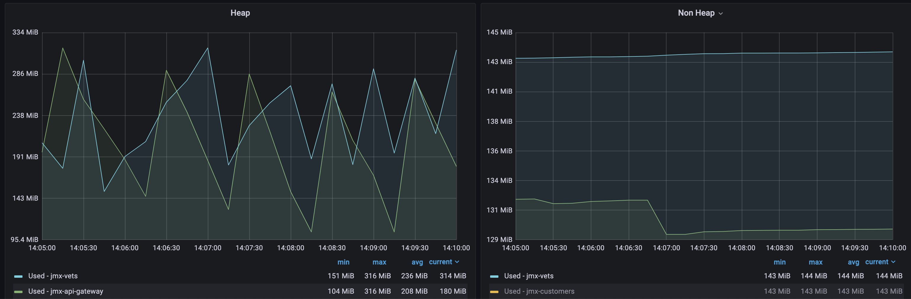
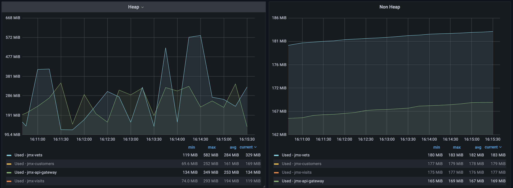
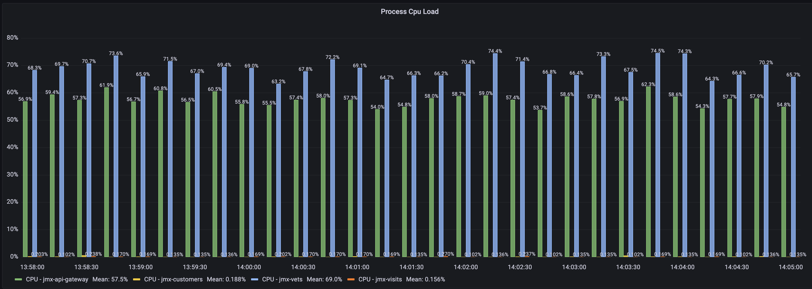
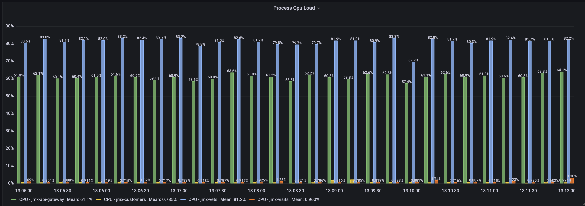
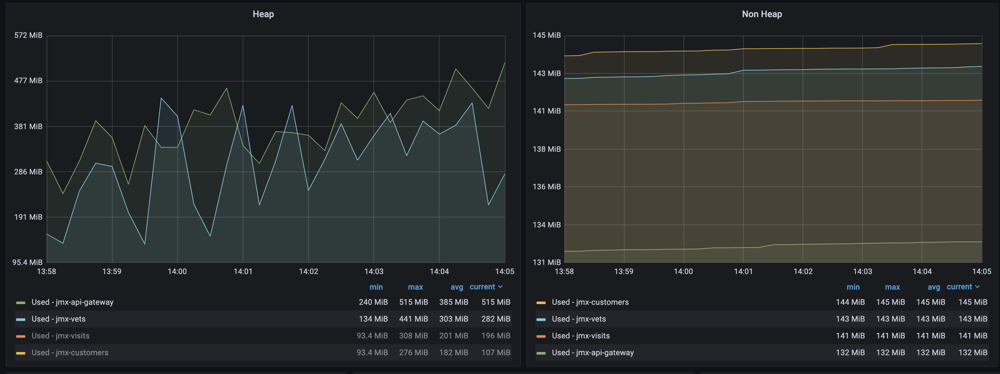
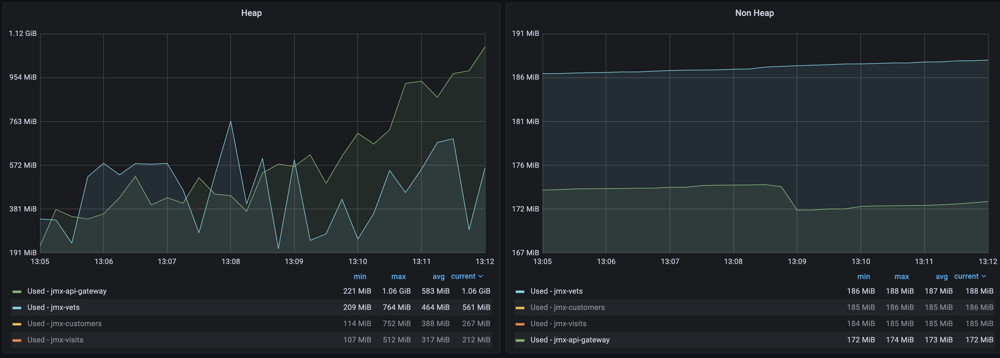

# Benchmark
We use [spring-petclinic applications](https://github.com/spring-petclinic/spring-petclinic-microservices) as the benchmark application because it is relatively close to the real user scenario.

We use three AWS EC2 machines in a subnet for the benchmark test:

- Gateway EC2: deploy `api-gateway`, `config-service`, and `discovery-server` on this node.
- Service EC2: deploy `customers-service`, `vets-service`, and `visits-service` on this node.
- Tester EC2: we initiate testing requests and collect testing metric data on this node.

All three AWS EC2 machines have the exact same configuration, and in a subnet:
```
CPU: 2 cores, Intel(R) Xeon(R) Platinum 8175M CPU @ 2.50GHz
MEM: 7850092 kB
SSD: XFS 100G

OS: CentOS Linux release 8.5.2111
Docker version 20.10.14, build a224086
docker-compose version 1.27.4, build 40524192
```

On Gateway EC2 node:
```
# lunch up without EaseAgent
env COMPOSER=gateway-compose EASEAGENT="" ./benchmark.sh start

# lunch up with EaseAgent
env COMPOSER=gateway-compose EASEAGENT="true" ./benchmark.sh start

```

On Service EC2 node:
```
# lunch up without EaseAgent
env COMPOSER=service-compose EASEAGENT="" ./benchmark.sh start

# lunch up with EaseAgent
env COMPOSER=service-compose EASEAGENT="true" ./benchmark.sh start

```

On Tester EC2 node, we start Grafana/Prometheus:
```
env COMPOSER=benchmark-tester-compose EASEAGENT="" PROMETHEUS_CONFIG_FILE=prometheus_benchmark_2.yaml ./benchmark.sh start
```

We run `k6` on `Tester` node to start stress test, and collect the metric data.
```
k6 run vets.js
```

Environment details of the test, reference to the document in [Easeagent-spring-petclinic](https://github.com/megaease/easeagent-spring-petclinic/blob/main/doc/benchmark.md).

## Test Result

We access the URI: `/api/vet/vets` of the application, it will generate 10-Spans in total, and distributed in two serivces:
- jmx-api-gateway: 1 span;
- jmx-vets: 9spans.

By comparing the results of the two services, the impact of the number of SPANs can be observed.

For each value pair in the table, the former is the baseline value and the latter is the agent value (baseline / agent / difference value).

### 320 virtual users

| URI-Label               | CPU (baseline/agent/diff) | Heap Memory    | P90 Latency                 | Throughput (15s) |
|-------------------------|:-----------------------|:------------------|:----------------------------|-----------------------|
| jmx-api-gateway: 1spans | 33.2% / 44.4% / 21.2%  | 208M / 253M / 45M |                             |                       |
| jmx-vets: 9spans        | 40.2% / 65.2% / 25.0%  | 236M / 284M / 48M | 28.94 ms / 189.39 ms / 553% | 1164 / 1057 / -9.2%  |

#### CPU

| Label     |  jmx-api-gateway  | jmx-vets              |
|-----------|:------------------|:----------------------|
| Baseline  | 33.2%             |  40.2%                |
| Agent     | 44.4%             |  65.2%                |
| Diff      | 21.2%             |  25.0%                |

- Baseline:


- Agent:



#### Heap
- Baseline:

- Agent:



#### Lagency & Throuthput

| Label     |  P90 Latency (ms) | Throughput (reqs/s)   |
|-----------|:------------------|:----------------------|
| Baseline  | 28.94             |  1164                 |
| Agent     | 189.39            |  1057                 |

- Baseline

```
running (11m40.4s), 000/320 VUs, 203885 complete and 0 interrupted iterations
default ✓ [======================================] 000/320 VUs  11m40s

     data_received..................: 637 MB 910 kB/s
     data_sent......................: 78 MB  111 kB/s
     http_req_blocked...............: avg=3.98µs   min=687ns  med=1.84µs  max=13.63ms  p(90)=3.44µs   p(95)=4.86µs
     http_req_connecting............: avg=741ns    min=0s     med=0s      max=13.58ms  p(90)=0s       p(95)=0s

     http_req_duration..............: avg=14.2ms   min=1.1ms  med=7.83ms  max=475.17ms p(90)=28.94ms  p(95)=45.38ms
       { expected_response:true }...: avg=14.2ms   min=1.1ms  med=7.83ms  max=475.17ms p(90)=28.94ms  p(95)=45.38ms

     http_req_failed................: 0.00%  ✓ 0           ✗ 815540
     http_req_receiving.............: avg=285.63µs min=8.6µs  med=73.14µs max=89.64ms  p(90)=462.23µs p(95)=889.81µs
     http_req_sending...............: avg=18.85µs  min=3.83µs med=8.29µs  max=54.16ms  p(90)=16.14µs  p(95)=22.15µs
     http_req_tls_handshaking.......: avg=0s       min=0s     med=0s      max=0s       p(90)=0s       p(95)=0s
     http_req_waiting...............: avg=13.9ms   min=1.04ms med=7.57ms  max=475.02ms p(90)=28.36ms  p(95)=44.63ms

     http_reqs......................: 815540 1164.420944/s

     iteration_duration.............: avg=1.02s    min=1s     med=1.01s   max=1.47s    p(90)=1.04s    p(95)=1.06s
     iterations.....................: 203885 291.105236/s
     vus............................: 5      min=5         max=320
     vus_max........................: 320    min=320       max=320

```
- Agent
```
running (11m40.8s), 000/320 VUs, 185219 complete and 0 interrupted iterations
default ↓ [======================================] 005/320 VUs  11m40s

     data_received..................: 579 MB 827 kB/s
     data_sent......................: 70 MB  100 kB/s
     http_req_blocked...............: avg=4.45µs  min=700ns  med=1.9µs   max=71.05ms  p(90)=3.47µs   p(95)=4.51µs
     http_req_connecting............: avg=1.39µs  min=0s     med=0s      max=70.99ms  p(90)=0s       p(95)=0s

     http_req_duration..............: avg=75.71ms min=1.52ms med=38.65ms max=1.18s    p(90)=189.39ms p(95)=275.46ms
       { expected_response:true }...: avg=75.71ms min=1.52ms med=38.65ms max=1.18s    p(90)=189.39ms p(95)=275.46ms

     http_req_failed................: 0.00%  ✓ 0           ✗ 740876
     http_req_receiving.............: avg=1.37ms  min=9.07µs med=54.95µs max=333.25ms p(90)=1.44ms   p(95)=6.48ms
     http_req_sending...............: avg=49.77µs min=3.85µs med=8.36µs  max=228.08ms p(90)=16.97µs  p(95)=23.34µs
     http_req_tls_handshaking.......: avg=0s      min=0s     med=0s      max=0s       p(90)=0s       p(95)=0s
     http_req_waiting...............: avg=74.29ms min=1.47ms med=37.3ms  max=1.18s    p(90)=186.62ms p(95)=273.55ms

     http_reqs......................: 740876 1057.248498/s

     iteration_duration.............: avg=1.12s   min=1s     med=1.07s   max=2.18s    p(90)=1.3s     p(95)=1.39s
     iterations.....................: 185219 264.312124/s
     vus............................: 5      min=5         max=320
     vus_max........................: 320    min=320       max=320

```

### 700 virtual users

| URI-Label                | CPU (baseline/agent/diff) | Heap Memory    | P90 Latency               | Throughput (15s) |
|----------------------|:--------------------------|:-------------------|:----------------------------------|-----------------------|
| jmx-api-gateway: 1spans | 57.5% / 61.1% / 3.6%   | 385M / 583M / 200M |                                   |                       |
| jmx-vets: 9spans        | 69.0% / 81.2% / 12.2%  | 303M / 464M / 151M | 564.69 ms / 737.55 ms / 30%       | 1800 / 1526 / -15.2%  |


- Process CPU Load: 3.6% - more than 10%, requiring optimisation, the number of span has a significant impact on CPU performance.
- Heap Memory: requiring optimisation.
- Latency & Throughput: Easeagent has an excessive impact on latency and throughput and is positively correlated with the number of Spans.

CPU, Process CPU Load, collected through JMX:java_lang_OperatingSystem_ProcessCpuLoad.

#### CPU
| Label     |  jmx-api-gateway  | jmx-vets              |
|-----------|:------------------|:----------------------|
| Baseline  | 57.5%             |  69.0%                |
| Agent     | 61.1%             |  81.2%                |
| Diff      | 3.60%             |  12.2%                |

- Baseline:


- Agent:


#### Heap

- Baseline:

- Agent:


#### Lagency & Throuthput
| Label     |  P90 Latency (ms) | Throughput (reqs/s)   |
|-----------|:------------------|:----------------------|
| Baseline  | 564.69            |  1800                 |
| Agent     | 737.55            |  1526                 |

- Baseline:
```
running (13m20.6s), 000/700 VUs, 360354 complete and 0 interrupted iterations
default ↓ [======================================] 009/700 VUs  13m20s

     data_received..................: 1.1 GB  1.4 MB/s
     data_sent......................: 137 MB  171 kB/s
     http_req_blocked...............: avg=6.6µs    min=704ns  med=1.88µs   max=269.76ms p(90)=3.35µs   p(95)=5.16µs
     http_req_connecting............: avg=3.22µs   min=0s     med=0s       max=254.77ms p(90)=0s       p(95)=0s

     http_req_duration..............: avg=262.62ms min=1.19ms med=219.42ms max=1.58s    p(90)=564.69ms p(95)=669.43ms

       { expected_response:true }...: avg=262.62ms min=1.19ms med=219.42ms max=1.58s    p(90)=564.69ms p(95)=669.43ms
     http_req_failed................: 0.00%   ✓ 0           ✗ 1441416
     http_req_receiving.............: avg=7.48ms   min=8.94µs med=517.01µs max=480.89ms p(90)=17.64ms  p(95)=38.22ms
     http_req_sending...............: avg=105.42µs min=3.72µs med=8.55µs   max=236.91ms p(90)=20.64µs  p(95)=37.64µs
     http_req_tls_handshaking.......: avg=0s       min=0s     med=0s       max=0s       p(90)=0s       p(95)=0s
     http_req_waiting...............: avg=255.03ms min=1.12ms med=208.8ms  max=1.58s    p(90)=554.48ms p(95)=661.33ms

     http_reqs......................: 1441416 1800.434166/s

     iteration_duration.............: avg=1.37s    min=1s     med=1.36s    max=2.69s    p(90)=1.74s    p(95)=1.86s
     iterations.....................: 360354  450.108541/s
     vus............................: 9       min=5         max=700
     vus_max........................: 700     min=700       max=700

```

- Agent
```
running (13m20.9s), 000/700 VUs, 305670 complete and 0 interrupted iterations
default ✓ [======================================] 000/700 VUs  13m20s

     data_received..................: 956 MB  1.2 MB/s
     data_sent......................: 116 MB  145 kB/s
     http_req_blocked...............: avg=11.59µs  min=688ns  med=1.94µs   max=399.48ms p(90)=3.48µs   p(95)=4.62µs
     http_req_connecting............: avg=6.21µs   min=0s     med=0s       max=217.13ms p(90)=0s       p(95)=0s

     http_req_duration..............: avg=360.83ms min=1.45ms med=252.27ms max=7.99s    p(90)=737.55ms p(95)=1.04s

       { expected_response:true }...: avg=360.83ms min=1.45ms med=252.27ms max=7.99s    p(90)=737.55ms p(95)=1.04s
     http_req_failed................: 0.00%   ✓ 0           ✗ 1222680
     http_req_receiving.............: avg=4.88ms   min=9.14µs med=51.6µs   max=887.76ms p(90)=10.7ms   p(95)=28.04ms
     http_req_sending...............: avg=193.63µs min=3.72µs med=8.54µs   max=756.82ms p(90)=19.57µs  p(95)=44.94µs
     http_req_tls_handshaking.......: avg=0s       min=0s     med=0s       max=0s       p(90)=0s       p(95)=0s
     http_req_waiting...............: avg=355.75ms min=1.36ms med=248.41ms max=7.99s    p(90)=727.94ms p(95)=1.03s

     http_reqs......................: 1222680 1526.574647/s

     iteration_duration.............: avg=1.62s    min=1s     med=1.41s    max=8.99s    p(90)=2.36s    p(95)=2.76s
     iterations.....................: 305670  381.643662/s
     vus............................: 6       min=5         max=700
     vus_max........................: 700     min=700       max=700
```


## Conclusion

Optimisation is required in terms of cpu efficiency/memory usage and latency throughput.
The average heap memory has been growing slowly, so there may be a memory leak that needs to be addressed.
