# Benchmark
We use [spring-petclinic applications](https://github.com/spring-petclinic/spring-petclinic-microservices) as the benchmark application because it is relatively close to the real user scenario.

We use three AWS EC2 machines in a subnet for the benchmark test:

- Baseline EC2: run the application stack without Easeagent.
- Agent EC2: run the application with Easeagent.
- Tester EC2: we initiate testing requests and collect testing metric data on this node.

We run Jmeter on `Tester` node to start two identical thread groups to access the `Baseline` node and `Agent` node at the same time, and collect the metric data.

## Test Result

We access two URIs of the application.
- API-URI-owner-3spans: /api/gateway/owners/2
- API-URI-vets-10spans: /api/vet/vets

These two URIs generate 3 and 10 SPANs respectively, and by comparing the results of the two data the impact of the number of SPANs can be observed.

For each value pair in the table, the former is the baseline value and the latter is the agent value (baseline / agent / difference value).

- 10 threads groups 

| URI-Label                | CPU (baseline/agent/diff) | Heap Memory        | P75 Latency               | Throughput (15s) |
|----------------------|:--------------------------|:-------------------|:--------------------------|------------------|
| API-URI-owner-3spans | 10.7% / 13.3% / 2.5%      | 246M / 289M / 43M  | 100ms  / 120ms  / 20ms    | 361 / 293 / -68  |
| API-URI-vets-10spans | 8.56% / 11.3% / 2.64%     | 261M / 200M / -61M | 58.8ms / 88.8ms / 30ms    | 361 / 293 / -68  |

- 20 threads groups 

| URI-Label                | CPU (baseline/agent/diff) | Heap Memory        | P75 Latency               | Throughput (15s) |
|----------------------|:--------------------------|:-------------------|:--------------------------|------------------|
| API-URI-owner-3spans | 10.0% / 12.8% / 2.8%      | 244M / 282M / 38M  | 43ms / 49ms / 6ms         | 332 / 277 / -55  |
| API-URI-vets-10spans | 8.43% / 11.0% / 2.57%     | 179M / 255M / -71M | 26ms / 36ms / 10ms        | 332 / 277 / -55  |

- 50 threads groups 

| URI-Label                | CPU (baseline/agent/diff) | Heap Memory        | P75 Latency               | Throughput (15s) |
|----------------------|:--------------------------|:-------------------|:--------------------------|------------------|
| API-URI-owner-3spans | 10.3% / 12.8% / 2.5%      | 263M / 296M / 33M  | 214ms / 241ms / 27ms      | 357 / 300 / -57   |
| API-URI-vets-10spans | 8.12% / 10.5% / 2.38%     | 175M / 191M / 16M  | 117ms / 161ms / 44ms      | 357 / 300 / -57   |

- Process CPU Load: Easeagent will increase the process CPU load by about 3%.
- Heap Memory: EaseAgent has a minimal impact on memory usage.
- Latency & Throughput: Easeagent has an excessive impact on latency and throughput and is positively correlated with the number of Spans.

CPU, Process CPU Load, collected through JMX:java_lang_OperatingSystem_ProcessCpuLoad, this may be replaced by other method.

### Data of 10 Threads Groups 
#### CPU
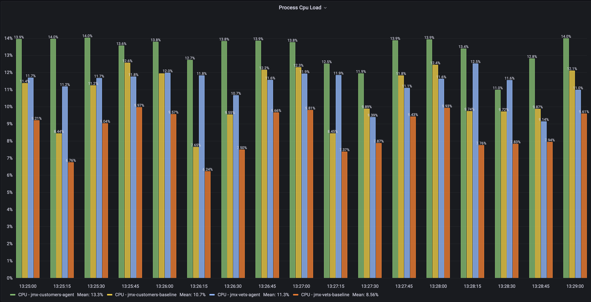

#### Heap
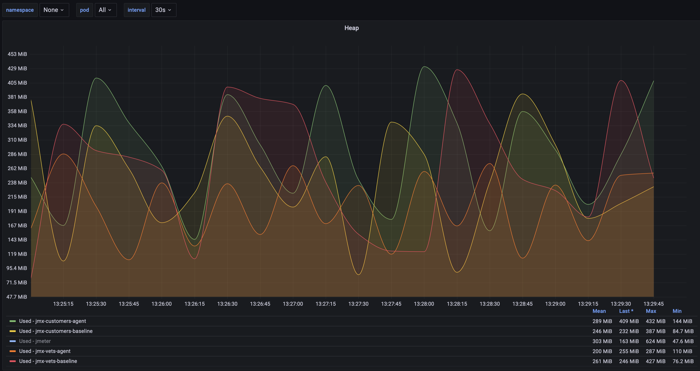

#### Lagency & Throuthput
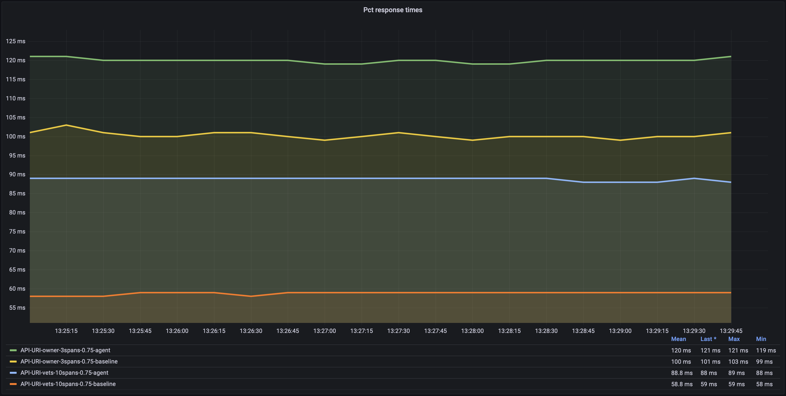
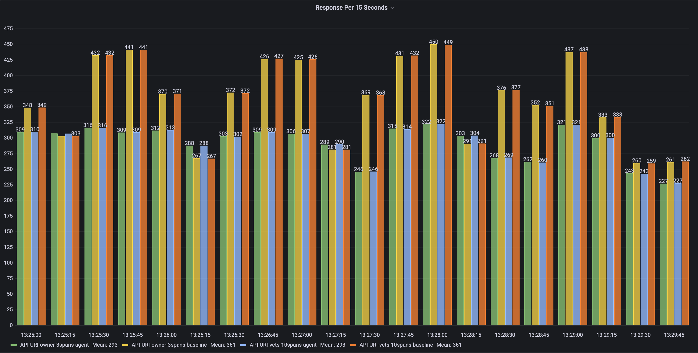

### Data of 20 Threads Groups 
#### CPU
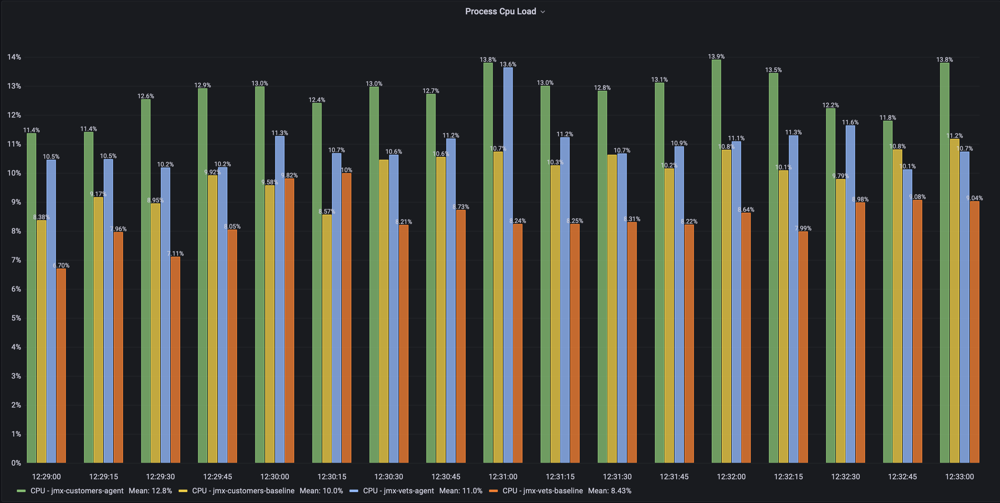

#### Heap
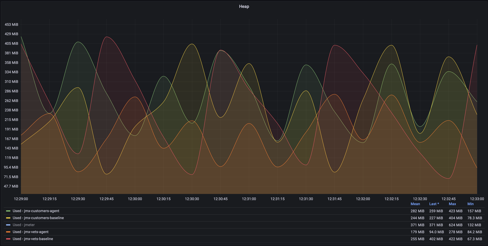

#### Lagency & Throuthput
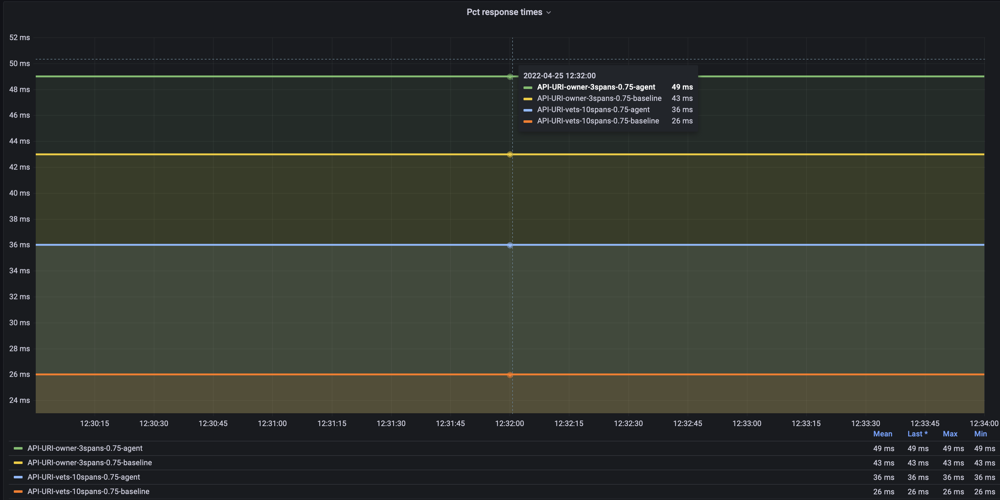
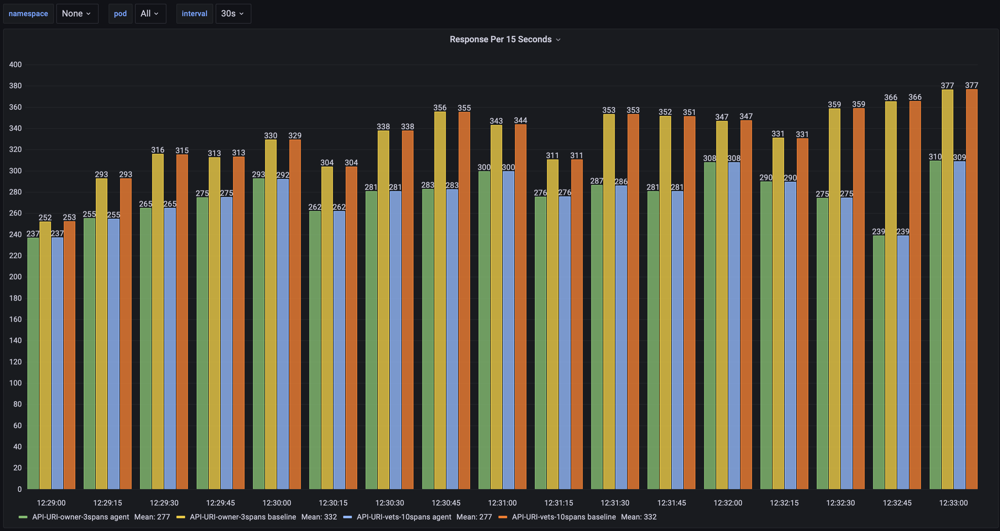

### Data of 50 Threads Groups 
#### CPU
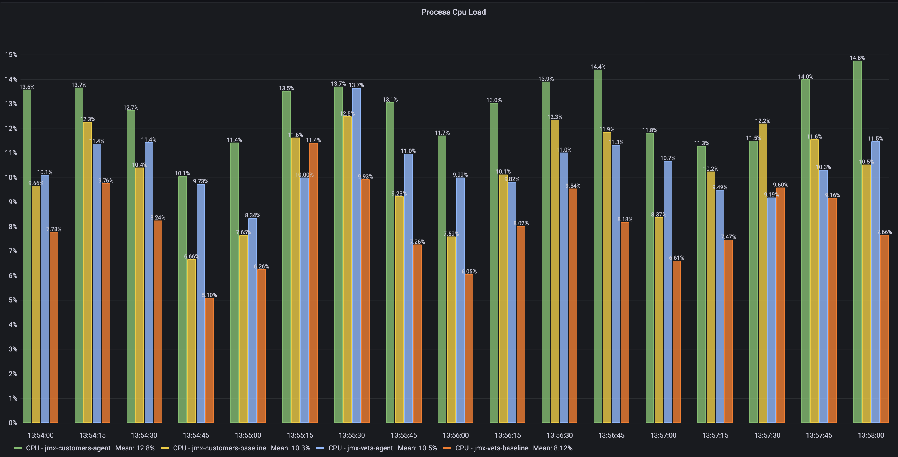

#### Heap
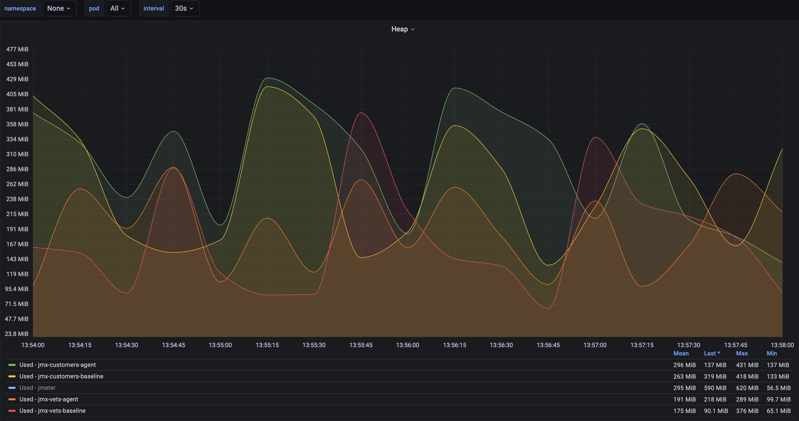

#### Lagency & Throuthput
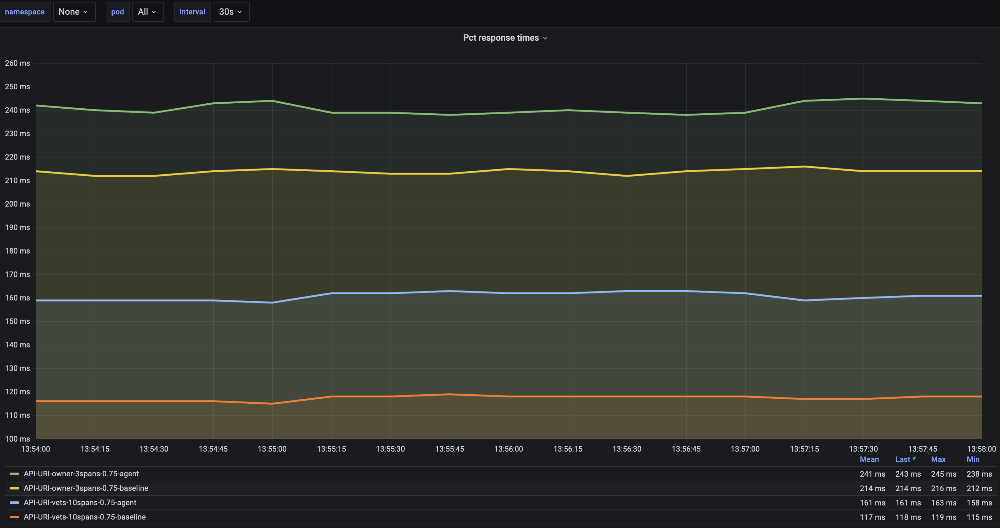
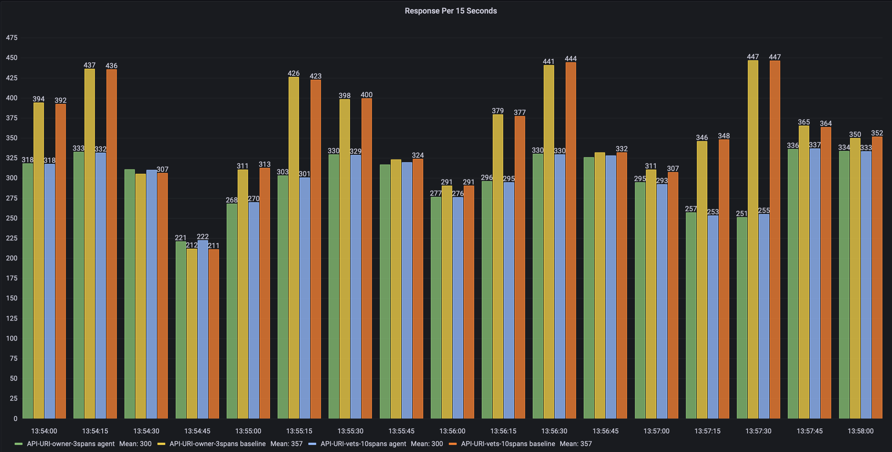

## Test Method
if you want to reproduce this test, reference to the document in [Easeagent-spring-petclinic](https://github.com/megaease/easeagent-spring-petclinic/blob/main/doc/benchmark.md).

## Conclusion
The bottleneck of Easeagent is mainly in latency and throughput, which requires optimization of the asynchronous processing module, such as introducing a lock-free mechanism.

