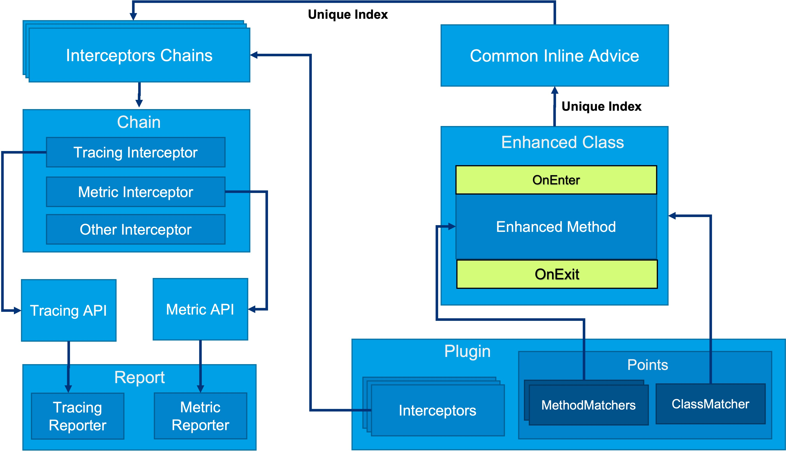
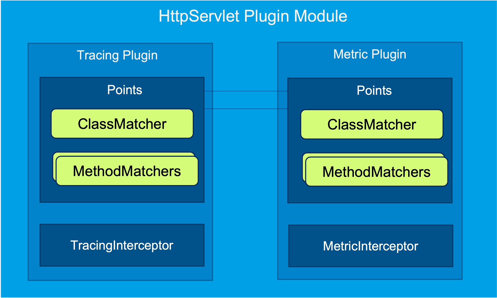
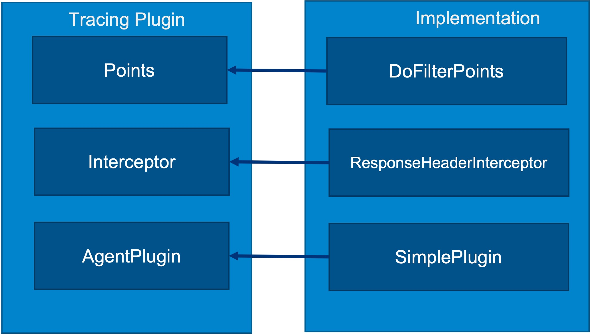
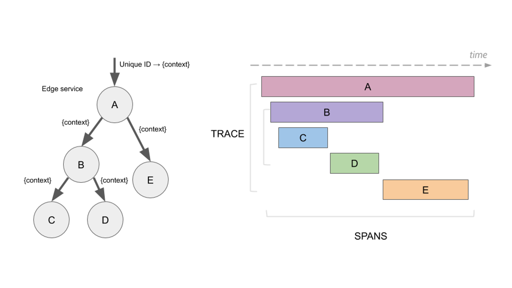
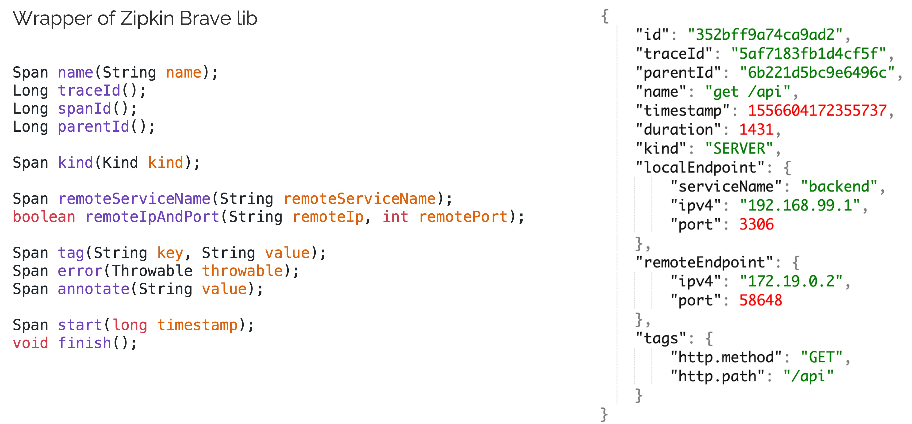

- [EaseAgent架构](#EaseAgent架构)
- [插件设计](#插件设计)
  - [增强点Points](#增强点Points)
    - [类匹配器](#类匹配器)
    - [方法匹配器](#方法匹配器)
  - [拦截器Interceptor](#拦截器Interceptor)
  - [配置：AgentPlugin](#配置_AgentPlugin)
  - [最简单插件](#最简单插件)
    - [Points](#Points)
    - [Interceptor](#Interceptor)
    - [AgentPlugin](#AgentPlugin)
- [EaseAgent Tracing插件实例](#EaseAgent_Tracing插件实例)
  - [Span & Trace](#Span_&_Trace)
  - [Conetxt](#Conetxt)
  - [HttpServletPlugin](#HttpServletPlugin)
- [EaseAgent插件调试FAQ](#EaseAgent插件调试FAQ)
  - [环境配置](#环境配置)
  - [增强调试](#增强调试)
  - [业务调试](#业务调试)
  - [性能验证](#性能验证)
  

# EaseAgent架构
EaseAgent 2.0的架构如下图所示，在2.0版本的EaseAgent中，我们引入了增强插件机制，以满足不同业务架构对Agent进行扩展的需求。



所有的Javaagent的核心支点都是对特定的方法进行增强，以实现增强业务，如Tracing和Metric业务。同样的，EaseAgent的增强插件机制的出发点是设计一套易于理解使用并且高效可靠的插件接口框架，能让用户方便地对特定方法进行增强以实现业务需求。

为了易于理解和使用，我们将插件抽象成三要素：Points、Interceptors和AgentPlugin。
- **Points** 用于确定在何处增强；
- **Interceptors** 用于定义做什么，即在Points确定的增强点所要执行的业务逻辑；
- **AgentPlugin** 则让插件可配置并且配置可运行时动态更新。

高效可靠，则需要从内部实现地设计上尽可能地实现最优解法。每一个增强方法点（Points）都有可能被不同的业务需求方进行增强，如何不管有多少种业务增强，插入的字节码始终简单、可靠呢？又如何让同一个点上的不同业务增强逻辑对彼此既可无感知又可互相协作？
- **让多个插件可以对一个方法进行多重增强**。我们让同一方法上的多个插件的Interceptors组成一个Interceptors Chain，并让每一个增强方法点都只增强一段简短字节码，同时为方法点分配一个唯一Id（unique Index），用于增强字节码运行时作为数组索引获取对应的Interceptors Chains；
- **插件间即可以无感知又可以相互协作**。在一个Interceptors Chain中，各Interceptors之间的优先级可编排，还需要提供了Interceptors之间数据交换的机制。

另外，增强Interceptors是为了实现业务需求，我们为最为常见的Tracing和Metric业务提供了封装的API接口，这样增强插件就可以通过API的辅助较为快速地完成Tracing和Metric采集需求。而Report组件则负责完成数据格式封装和上传后端服务器的职责，它同样可定制和扩展，以满足不同数据格式和网络架构地需求。

# 插件设计

如前所述，我们将插件抽象成了三要素，对应三个接口。插件开发就是实现三个接口，分别完成了增强点定义、增强业务逻辑和配置信息定义。工程上，一个完整的插件模块，也就是一个插件项目，可以包含多个插件，如下图所示，HttpServlet插件子项目里包含了多个插件实现。



## 增强点Points
增强点定义通过Points接口类实现来完成，Points包含三个接口方法：
```java
public interface Points {
    /**
     * return the defined class matcher matching a class or a group of classes
     */
    IClassMatcher getClassMatcher();

    /**
     * return the defined method matcher
     */
    Set<IMethodMatcher> getMethodMatcher();

    /**
     * When returning true, add a dynamic field to matched classes
     * The dynamically added member can be accessed by AgentDynamicFieldAccessor
     */
    default boolean isAddDynamicField() {
        return false;
    }
}
```

Points的三个接口方法分别用来确定一个类匹配器、一组方法匹配器及是否对类扩展成员。扩展出来的成员可以用于数据传递和交换，更重要的是类匹配器和方法匹配器，EaseAgent会在类匹配器匹配到的类中，使用方法匹配器来确定要进行增强的方法。

那么类匹配器和方法匹配器是如何定义和设计的呢？

### 类匹配器

设计类匹配器，我们首先要确定类匹配器的匹配要素，有哪些要素是用来确定一个具体的类的呢？通过查看JVM规范中对类结构的描述，其中包含了类的各要素，但显然不是每一个要素都需要成为匹配要素的，比如类成员fields、类方法methods等，因为极少会通过类成员或类包含的方法来匹配一个类。
```
A class file consists of a single ClassFile structure:
   ClassFile {
       u4             magic;
       u2             minor_version;
       u2             major_version;
       u2             constant_pool_count;
       cp_info        constant_pool[constant_pool_count-1];
       u2             access_flags;
       u2             this_class;
       u2             super_class;
       u2             interfaces_count;
       u2             interfaces[interfaces_count];
       u2             fields_count;
       field_info     fields[fields_count];
       u2             methods_count;
       method_info    methods[methods_count];
       u2             attributes_count;
       attribute_info attributes[attributes_count];
}
```

通过总结归纳，一般会用来作为类匹配的要素，主要包含：
- 类名（this_class）
- 实现接口(interfaces)
- 父类(super_class)
- 访问标志(access_flags)
- 注解(attributes: annotation)

确定以上匹配要素后，就相应的可以确定类匹配器ClassMatcher的DSL：
```java
hasSuperClass(String className)
hasClassName(String className)
hasAnnotation(String className)
hasInterface(String className)

isPublic();
isPrivate();
isAbstract();
isInterface();
notPrivate();
notAbstract();
```

### 方法匹配器
通过类匹配器，选出需要增强的类之后，我们通过方法匹配器将其中需要增强的方法选出。我们又需要用什么要素来确定一个方法呢？同样的，查看JVM规范中对方法结构的描述：
```java
The structure has the following format:
   method_info {
       u2             access_flags;
       u2             name_index;
       u2             descriptor_index;
       u2             attributes_count;
       attribute_info attributes[attributes_count];
}
```

总结分析，需要用于方法匹配的要素包括：
- 方法名(name_index)
- 访问标志(access_flags)
- 参数类型(descriptor_index)
- 返回值类型(descriptor_index)
- 注解(@Override)

同样的，确定匹配要素后，方法匹配器的DSL也就确定了，更多具体的接口可以参考Github上的[Matcher-DSL文档](../matcher-DSL.md)。

## 拦截器Interceptor

拦截器Interceptor实现具体的业务逻辑，是插件三要素中最重要的接口，因业务不同实现可能千差万别，是插件开发的核心接口。

Interceptor需要为插件开发者提供什么样的能力，以满足各种场景下的插件扩展开发呢？插件业务即可能是数据面的数据采集业务，如Tracing；也可能是控制面的行为控制业务，如Redirection重定向插件，因此Interceptor既要让业务逻辑有访问当前方法调用实例、参数、返回值的能力，同时也需要提供修改参数、返回值的能力。如下Interceptor接口定义，这些读写能力正是通过MethodInfo参数及其接口提供给业务逻辑的。
```java
public interface Interceptor extends Ordered {
    void before(MethodInfo methodInfo, Context context);

    void after(MethodInfo methodInfo, Context context);

    default String getType() {
        return Order.TRACING.getName();
    }
    ......
}
```

Interceptor之间彼此可不感知，但有时需要协作。关联到一个增强方法上的多个Interceptors形成一个Interceptors Chain，彼此之间优先次序是通过Ordered接口来确定的，而协作所需的数据传递交换，具体实现可以根据业务场景灵活多样，但Context参数通过put/get接口提供了基本的传递交换能力。

那么如何将Interceptor业务实现最终绑定到具体的增强点Points上面呢？不同于用配置文件指定关联的方式，我们通过@AdviceTo注解来进行绑定。
```java
@Retention(RetentionPolicy.RUNTIME)
@Target(ElementType.TYPE)
@Repeatable(AdvicesTo.class)
public @interface AdviceTo {
    Class<? extends Points> value();
    Class<? extends AgentPlugin> plugin() default AgentPlugin.class;
    String qualifier() default "default";
}
```

@AdviceTo注解将一个特定的Interceptor实现关联到value指定的增强点Points实现，并通过qualifier具体的绑定到了该Points中的具有该名称（默认为“default”）的方法匹配器上。
```java
@AdviceTo(value = DoFilterPoints.class, plugin = SimplePlugin.class)
public class ResponseHeaderInterceptor implements Interceptor {
}
```
我们还看到@AdviceTo注解同时还通过`plugin()`将当前Interceptor绑定到特定的插件上，这让Interceptor具有获取动态更新的特定插件配置的能力。

Interceptor的插件配置可以通过Context的getConfig接口获取。
`Context::getConfig()`接口获取的配置又是从哪里来的呢？我们将在接下来的AgentPlugin小节中具体描述动态更新的插件配置能力。

## 配置：AgentPlugin
AgentPlugin接口是三要素中最简单的接口，只有两个接口方法：
```java
public interface AgentPlugin extends Ordered {
    /**
     * define the plugin name, avoiding conflicts with others
     * it will be used as a namespace when getting the configuration.
     */
    String getNamespace();

    /**
     * define the plugin domain,
     * it will be used to get configuration when loaded:
     */
    String getDomain();
}
```

这两个接口实现为所有绑定到该Plugin的Interceptor确定了插件配置项的配置前缀：
```
plugin.[domain].[namespace].[type].key=value
```

其中domain和namespace就是由AgentPlugin接口确定；type则由Interceptor的getType()接口确定。在Interceptor的业务实现逻辑中，任何时候通过Context::getCofnig()获得的配置都是最新的以key-value组成的配置键值对，也就是说，在外部通过HTTP-Config-API调用更新配置后，配置将自动更新为最新配置。

以上，简要的说明了插件三要素的设计和使用方式，接下来我们通过看一个仅有三个类实现三要素接口的最简插件，来直观了解EaseAgent增强插件开发。

## 最简单插件

只需要实现三个接口即可完成一个简单的插件的开发。虽然插件开发因业务场景不同，复杂度各异，但用于说明插件机制，最简单的仅有三个接口实现的Simple插件是最合适的，该Simple插件源代码Github地址附于本节末。



如上图示，三个类DoFilterPoints、ResponseHeaderInterceptor和SimplePlugin分别实现插件三要素接口。


### Points
```java
public class DoFilterPoints implements Points {
   private static final String FILTER_NAME = "javax.servlet.Filter";
   private static final String HTTP_SERVLET_NAME = "javax.servlet.http.HttpServlet";
   static final String SERVLET_REQUEST = "javax.servlet.ServletRequest";
   static final String SERVLET_RESPONSE = "javax.servlet.ServletResponse";

  
   @Override
   public IClassMatcher getClassMatcher() {
       return ClassMatcher.builder()
           .hasInterface(FILTER_NAME)
           .or()
           .hasSuperClass(HTTP_SERVLET_NAME)
           .build();
   }

   @Override
   public Set<IMethodMatcher> getMethodMatcher() {
       return MethodMatcher.builder().named("doFilter")
               .isPublic()
               .argsLength(3)
               .arg(0, SERVLET_REQUEST)
               .arg(1, SERVLET_RESPONSE)
               .returnType("void")
               .or()
               .named("service")
               .arg(0, SERVLET_REQUEST)
               .arg(1, SERVLET_RESPONSE)
               .qualifier("default")
               .build().toSet();
   }
}
```
### Interceptor
```java
@AdviceTo(value = DoFilterPoints.class, plugin = SimplePlugin.class)
public class ResponseHeaderInterceptor implements Interceptor {
   public static final String startKey = "servlet-start";

   @Override
   public void before(MethodInfo methodInfo, Context context) {
       HttpServletResponse resp = (HttpServletResponse)methodInfo.getArgs()[1];
       resp.setHeader("easeagent-srv-name", EaseAgent.getConfig(ConfigConst.SERVICE_NAME));
   }
}
```

### AgentPlugin
```java
public class SimplePlugin implements AgentPlugin {
   @Override
   public String getNamespace() {
       return "simple";
   }

   // ConfigConst.OBSERVABILITY;
   @Override
   public String getDomain() {
       return "observability";
   }
}
```

该插件仅实现一个简单功能，即往http的请求相应头中添加一个key为“easeagent-srv-name”的header，指明当前微服务名称。插件编译完之后，在easeagent.jar所在目录新建的plugins目录，将simple-plugin-1.0.0.jar拷贝到plugins下，然后带上easeagent.jar启动测试项目，就可以在HTTP响应头中看到插件效果：
```shell
# curl -v http://127.0.0.1:18081/employee/message
*   Trying 127.0.0.1:18081...
* Connected to 127.0.0.1 (127.0.0.1) port 18081 (#0)
> GET /employee/message HTTP/1.1
> Host: 127.0.0.1:18081
> User-Agent: curl/7.77.0
> Accept: */*
>
* Mark bundle as not supporting multiuse
< HTTP/1.1 200
< easeagent-srv-name: demo-springweb
< easeagent-duration: 53
< Content-Type: text/plain;charset=UTF-8
< Content-Length: 34
< Date: Wed, 16 Mar 2022 07:16:51 GMT
<
* Connection #0 to host 127.0.0.1 left intact
Gateway Called in employee Service%

```


除了“easeagent-srv-name”的响应头，我们还看到了表明请求响应时间的另一个响应头“easeagent-duration”，这是在最简插件三个类之外，另外添增加了Points增强点ResponseProcessPoints和ResponseDurationInterceptor来实现的，有兴趣的同学可访问源码查看细节。
```
https://github.com/megaease/easeagent-test-demo/tree/master/simple-plugin
```

# EaseAgent Tracing插件实例

以上我们讲了EaseAgent2.0 的架构和插件概念和设计细节，并通过最简Simple插件让插件三要素能被具体化地熟悉和使用。 但要进行实际业务插件的开发，还需要对具体业务的API有所了解，接下来我们结合实际的Tracing插件HttpServletPlugin来概要地说明如何使用Tracing API来完成一个Tracing插件开发。

### Span & Trace

在看具体实现之前，先简要介绍Tracing中的核心概念，Trace和Span。如上图，Trace代表一次完整的业务请求过程，包含多个Span，A-E；一个Span表示完整业务过程中的一个独立业务子单元，如一次数据库请求、方法调用或一次外部请求；Trace仅为逻辑概念，通过Span中的traceId来体现，有多个具有同一traceId的Span组成有向无环图。

我们通过具体的OpenZipkin格式的数据样例，更直观的了解Span概念和接口：


其中id即当前Span的唯一id；traceId则代表当前完整业务请求的Trace的唯一id，时常直接使用第一个Span的id，如上图中Span-A的id；parentId表示上一级Span的id，如上图中B的parentId即为Span-A的id；其他更具体的细节可以查看Openzipkin的文档。

可见，Tracing业务插件开发的关键点就是Span的采集生成和上报。那么EaseAgent通过什么接口来提供Span的采集生成和上报？

### Conetxt
插件三要素中的Interceptor接口实现是插件开发的核心，其中的before/after接口方法均携带了Context参数，正是通过Context的接口，开发者可以完成Tracing API调用，完成Span的采集和上报。


如上图，nextSpan()接口用于创建Span，而servReceive()和clientRequest()接口则是对nextSpan接口的封装，分别对应服务端收到请求的Span创建和对外请求的Span创建，它们将Span的内数据赋值操作做了封装。

接下来看具体HttpServlet的Tracing插件实现。
### HttpServletPlugin
我们本节重点在于Tracing业务实现，即对Tracing API的调用，均在Interceptor实现中，因此我们省略插件Points和AgentPlugin的对应实现，直接看Tracing的Intercepotor实现DoFilterTracingInterceptor。
```java
@Override
public void doBefore(MethodInfo methodInfo, Context context) {
  HttpServletRequest httpServletRequest = methodInfo.getArgs()[0];
  ...
  HttpRequest httpRequest = new HttpServerRequest(httpServletRequest);
  requestContext = context.serverReceive(httpRequest);

  httpServletRequest.setAttribute(PROGRESS_CONTEXT, requestContext);
  HttpUtils.handleReceive(requestContext.span(), httpRequest);
}
```

如上代码片段，可以看到在`before`中，调用了`context.serverReceive()`接口创建和初始化了Span，并通过`HttpUtils::handleReceive()`接口对Span中数据进行Http请求相关的赋值。
```java
@Override
public void doAfter(MethodInfo methodInfo, Context context) {
  ...
  try {
    Span span = requestContext.span();
    if (!httpServletRequest.isAsyncStarted()) {
      ...
      HttpUtils.finish(span, response);
    } else if (methodInfo.getThrowable() != null) {
      span.error(methodInfo.getThrowable());
      span.finish();
    } else {
      // async
      ...
    }
  } finally {
    requestContext.scope().close();
  }
}
```

在`after`方法中，调用了`HttpUtils::finish()`或`span.finish()`接口完成Span数据采集，同时上报。这就是实际Tracing插件中，对Trace API接口调用的概要说明，更具体的细节，可以查看EaseAgent中该文件源码:
```
https://github.com/megaease/easeagent/blob/master/plugins/httpservlet/src/main/java/com/megaease/easeagent/plugin/httpservlet/interceptor/DoFilterTraceInterceptor.java
```

# EaseAgent插件调试FAQ
以上基本涵盖了插件开发的各个方面，以下是插件开发过程中常见的调试问题，以下插件调试FAQ同样可以从[分享视频中](https://www.bilibili.com/video/BV1qr4y1B7f2?spm_id_from=333.999.0.0)的1:05:25 开始的部分了解。

## 环境配置
按照开发手册进行插件开发时，需要调试插件是否正常工作，需要先配置一下调试环境，简要说明如下。
- 将EaseAgent的源代码下载到本地，并添加到IDE的工作空间（workspace），编译输出位于源码目录build/target/easeagent-dep.jar，同时创建目录build/target/plugins；
- 将插件工程（如simple-plugin）添加到同一个工作空间，将编译后插件jar包拷贝到上一步中的build/target/plugins目录中，以使插件被加载；
- 将需携带EaseAgent的应用源代码（如spring-gateway/employee）添加到工作空间，配置Debug中的JVM选项，以便后续携带easeagent-dep.jar启动调试；
  例如：
  ```
  -javaagent:/path-to-easeagent/build/target/easeagent-dep.jar -Deaseagent.config.path=/my-own-if-changed-or-add/agent.properties -Deaseagent.log.conf=/my-own-if-changed/easeagent-log4j2.xml -Dnet.bytebuddy.dump=/path-to-dump/
  ```
  以上path路径需替换为用户实际环境路径。
- 设置断点，启动调试。
### 增强调试
- 如何确定目标类和方法是否被增强？
  在上一节环境配置第3步中设置了调试选项
  ```
  -Dnet.bytebuddy.dump=/path-to-dump/
  ```
  所有被增强的类的class文件将被打印到该目录下，将class文件反编译（IDEA可以直接拉入打开），查看对应方法是否有调用EaseAgent方法的增强字节码。

- 如何增强类dump目录下检查后确认方法未增强，如何调试？
  三个关键点：分别确认类匹配器，方法匹配器和其他所有问题
  - 所有匹配中的类都会执行到ForAdviceTransformer::transform(...)方法，可在此加条件断点，如未中断检查类匹配器；
  - 所有方法都会执行到AdviceRegistry::check(...)方法，可在此加条件断点，如未中断检查方法匹配器；
  - 通过1内的断点栈回朔到Bytebuddy源代码中的异常分支处设置断点，查看具体异常原因。
  以上三处可查所有增强失败问题。
### 业务调试
- 类方法已经确定被增强了，为何业务逻辑Interceptor没有被调用到？
  所有被增强的方法都会进入到以下两个方法：
  ```java
  com.megaease.easeagent.core.plugin.Dispatcher::enter
  com.megaease.easeagent.core.plugin.Dispatcher::exit
  ```
  可以在出入口处设置断点，进一步跟踪执行逻辑。
  一般最有可能的是插件对应配置的enabled=false或未配置。
  ```
  plugin.[domain].[namespace].[type].enabled=true
  ```
## 性能验证
为了验证或确认EageAgent对性能/时延的影响，可以通过Profiler工具，采样CPU，关注栈内megaease相关函数执行占比，确定性能/时延影响。

Profiler工具如Async-profiler、Arthas和VisualVm等。

最后祝使用和扩展EaseAgent愉快顺利，有任何建议或问题欢迎给我们提Issue或加入Slack社区一起讨论：

* [Github Issues](https://github.com/megaease/easeagent/issues)
* [Join Slack Workspace](https://join.slack.com/t/openmegaease/shared_invite/zt-upo7v306-lYPHvVwKnvwlqR0Zl2vveA) for function requirement, issues, and disscusion.
* [MegaEase on Twitter](https://twitter.com/megaease)
