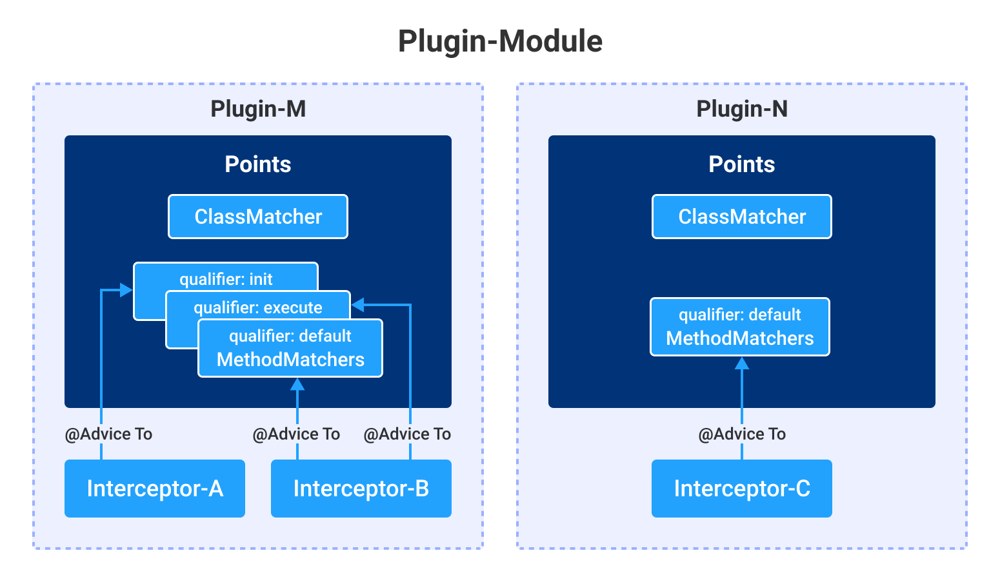

# Plugin Development Guide
- [Overview](#Overview)
- [Plugin Structure](#Plugin-structure)
    - [A Simple Plugin Example](#a-simple-plugin-example)
        - [AgentPlugin](#AgentPlugin)
        - [Points of Simple Plugin](#points-of-simple-plugin)
        - [Interceptor of Simple Plugin](#interceptor-of-simple-plugin)
        - [Test Result](#test-result)
    - [AgentPlugin](#AgentPlugin-plugin-definition)
    - [Points](#points)
    - [Interceptor](#interceptor)
    - [AdviceTo Annotation](#adviceto-annotation)
    - [Plugin Orchestration](#plugin-orchestration)
    - [Plugin Configuration](#plugin-configuration)
- [Tracing API](#Tracing-API)
- [Metric API](#Metric-API)
- [Logging API](#logging-API)
- [Configuration API](#Configuration-API)

## Overview
Most of the Easeagent's functions are supported by plugins.   
This document describes how to develop plugins for Easeagent, and it will be divided into the following sections to introduce plugin development.
1. Plugin structure, the plugin contains four components, which are the **AgentPlugin definition**, **Points**, **Interceptor** and **@AdviceTo Annotation** used to bind the three.
2. Tracing API, which helps users complete the transaction tracing task.
3. Metric API, helps users to complete metrics data collection.
4. Logging API
5. Configuration API

##  Plugin Structure
All plugin-modules are locate in the `plugins` folder under the top-level directory of Easeagent project and a plugin-module can contains serveral plugins, eg. a "Tracking Plugin" and a "Metirc Plugin". 


Let's start with a simple plugin.

### A Simple Plugin Example
Suppose this plugin is to help complete the Tracing function, the name of the current microservice needs to be added to the Response header. So we can define the domain of the plugin as "observability", and then we will give the simple plugin a namespace "simple". The full source code is available [here](https://github.com/megaease/easeagent-test-demo/tree/master/simple-plugin).

This plugin contain only three interface implementations: `AgentPlugin`, `Points` and `Interceptor`, corresponding to the classes `SimplePlugin`, `DoFilterPoints` and `ResponseHeaderInterceptor` respectively.

```
# Full code structure
▾ src/main/java/com/megaease/easeagent/plugin/simple/
  ▾ points/
      DoFilterPoints.java
  ▾ interceptor/
      ResponseHeaderInterceptor.java
    SimplePlugin.java
  pom.xml
```
#### AgentPlugin
```java
public class SimplePlugin implements AgentPlugin {
    @Override
    public String getNamespace() {
        return "simple";
    }

    @Override
    public String getDomain() {
        return ConfigConst.OBSERVABILITY;
    }
}
```
#### Points of Simple Plugin
To decouple from ByteBuddy, `ClassMatcher` and `Methodmatcher` are wrapped with reference to the DSL of **ByteBuddy**.
When there is only one methodmatcher in the return set of `getMethodMather()`, the qualifer value defaults to 'default', and there is no need to explicitly assign a value.
```java
public class DoFilterPoints implements Points {
    @Override
    public IClassMatcher getClassMatcher() {
        return ClassMatcher.builder()
            .hasInterface("javax.servlet.Filter")
            .or()
            .hasSuperClass("javax.servlet.http.HttpServlet")
            .build();
    }

    @Override
    public Set<IMethodMatcher> getMethodMatcher() {
        return MethodMatcher.builder().named("doFilter")
                .isPublic()
                .argsLength(3)
                .arg(0, "javax.servlet.ServletRequest")
                .arg(1, "javax.servlet.ServletResponse")
                .returnType("void")
                .or()
                .named("service")
                .arg(0, "javax.servlet.ServletRequest")
                .arg(1, "javax.servlet.ServletResponse")
                .build().toSet();
    }
}
```

#### Interceptor of Simple Plugin
This `ResponseHeaderInterceptor` is bound to the enhancement point defined above via the `@AdviceTo` annotation, and does not need to be explicitly assigned a qualifier value when qualifier is the default value. 
```java
@AdviceTo(value = DoFilterPoints.class, plugin = SimplePlugin.class)
public class ResponseHeaderInterceptor implements Interceptor {
    @Override
    public void before(MethodInfo methodInfo, Context context) {
    }

    @Override
    public void after(MethodInfo methodInfo, Context context) {
        HttpServletResponse httpServletResponse = (HttpServletResponse) methodInfo.getArgs()[1];
        String serviceName = EaseAgent.getConfig(ConfigConst.SERVICE_NAME);
        httpServletResponse.setHeader("easeagent-srv-name", serviceName);
    }

    @Override
    public String getName() {
        return Order.TRACING.getName();
    }

    @Override
    public int order() {
        return Order.TRACING.getOrder();
    }
}
```

#### Test Result
When the plugin is integrated into the `plugins` subdirectory in the easeagent project source tree, it will be compiled into the easeagent-dep.jar package. But this simple plugin is compiled independently of easeagent, so the compiled output plugin jar package `simple-plugin-1.0.0.jar` need to be copied to the **plugins** directory which is at the same level directory as easeagent.jar (create if not existing), to allow easeagent to detect it.


Using the spring-web module under ease-test-demo as a test project, execute the following test and the header information added can be seen in the HTTP Response.
```
easeagent-srv-name: demo-service
```
```
# curl -v http://127.0.0.1:18888/web_client

*   Trying 127.0.0.1...
* TCP_NODELAY set
* Connected to 127.0.0.1 (127.0.0.1) port 18888 (#0)
> GET /web_client HTTP/1.1
> Host: 127.0.0.1:18888
> User-Agent: curl/7.64.1
> Accept: */*
>
< HTTP/1.1 200
< easeagent-srv-name: demo-service
< Content-Type: text/plain
< Transfer-Encoding: chunked
< Date: Fri, 10 Dec 2021 08:38:09 GMT
<
* Connection #0 to host 127.0.0.1 left intact
easeagent-1639125480780* Closing connection 0

```

### AgentPlugin: Plugin definition
Plugin definition, defines what `domain` and `namespace` of this plugin by implement the `AgentPlugin` interface.

```java
public interface AgentPlugin extends Ordered {
    /**
     * define the plugin name, avoiding conflicts with others
     * it will be use as namespace when get configuration.
     */
    String getNamespace();

    /**
     * define the plugin domain,
     * it will be use to get configuration when loaded:
     */
    String getDomain();
}

```
The `AgentPlugin` interface also includes the `Order` interface that defines the order of the plugins, which is related to plugin orchestration. Plugin orchestration will be described in [Plugin Orchestration](#plugin-orchestration) section.

### Points
`Points` implementation defines methods to be enhanced and if a dynamic private member with access methods for that member are added to the instance of matched classes.
When there are multiple methods in a matched class that require enhancement with different interceptors, a qualifier needs to be assigned to each `MethodMatcher` as the keyword used by different interceptors to bind.

To decouple from ByteBuddy, `ClassMatcher` and `Methodmatcher` are wrapped with reference to the DSL of **ByteBuddy**.
```java
public interface Points {
    /**
     * return the defined class matcher matching a class or a group of classes
     * eg.
     * ClassMatcher.builder()
     *      .hadInterface(A)
     *      .isPublic()
     *      .isAbstract()
     *      .build()
     *      .or()
     *        .hasSuperClass(B)
     *        .isPublic()
     *        .build())
     */
    IClassMatcher getClassMatcher();

    /**
     * return the defined method matcher
     * eg.
     * MethodMatcher.builder().named("execute")
     *      .isPublic()
     *      .argNum(2)
     *      .arg(1, "java.lang.String")
     *      .build().toSet()
     * or
     * MethodMatcher.multiBuilder()
     *      .match(MethodMatcher.builder().named("<init>")
     *          .argsLength(3)
     *          .arg(0, "org.apache.kafka.clients.consumer.ConsumerConfig")
     *          .qualifier("constructor")
     *          .build())
     *      .match(MethodMatcher.builder().named("poll")
     *          .argsLength(1)
     *          .arg(0, "java.time.Duration")
     *          .qualifier("poll")
     *          .build())
     *      .build();
     */
    Set<IMethodMatcher> getMethodMatcher();

    /**
     * when return true, the transformer will add a Object field and a accessor
     * The dynamically added member can be accessed by AgentDynamicFieldAccessor:
     *
     * AgentDynamicFieldAccessor.setDynamicFieldValue(instance, value)
     * value = AgentDynamicFieldAccessor.getDynamicFieldValue(instance)
     */
    default boolean isAddDynamicField() {
        return false;
    }
}
```

### Interceptor
Interceptors is the core of implementing specific enhancements. 

`Interceptor` interface has a name method `getName` and a initialization method `init`. 
- The name will be used as `serviceId` in combination with the `domain` and `namespace` of the binding plugin to get the plugin configuration which will be automatically injected into the `Context`. The description of the plugin configuration can be found in the user manual.
- The `init` method is invoked during transfrom, allowing users to initialize staic resources of interceptor, and also allowing to load third party classes which can't load by running time classloader.

The `before` and `after` methods of the interceptor are invoked when the method being enhanced enters and returns, respectively.
Both `before` and `after` methods have parameters `MethodInfo` and `Context`. 
- `MethodInfo` contains all method information, including class name, method name, parameters, return value and exception information.
- `Context` contains the Interceptor configuration that is automatically injected and updated ant other interface that support `tracing`, for details, please refer to the [Tracing API](#tracing-api) section.

```java
public interface Interceptor extends Ordered {
    /**
     * @param methodInfo instrumented method info
     * @param context    Interceptor can pass data, method `after` of interceptor can receive context data
     */
    void before(MethodInfo methodInfo, Context context);

    /**
     * @param methodInfo instrumented method info
     * @param context    Interceptor can pass data, method `after` of interceptor can receive context data
     */
    default void after(MethodInfo methodInfo, Context context) {
    };

    /**
     * Interceptor can get interceptor config thought Config API :
     * EaseAgent.configFactory.getConfig
     * Config API require 3 params: domain, nameSpace, name
     * domain and namespace are defined by plugin, the third param, name is defined here
     *
     * @return name, eg. tracing, metric, etc.
     */
    default String getName() {
        return Order.TRACING.getName();
    }

    /**
     * Initialization method for the interceptor,
     * This method will be called and only be called once for every method which is injected by this interceptor,
     * which means this method may be called several times, when there are several methods matched
     *
     * @param config interceptor configuration
     * @param className injected method's class name
     * @param methodName injected method name
     * @param methodDescriptor injected method descriptor
     */
    default void init(Config config, String className, String methodName, String methodDescriptor) {
    }
}
```
The `Interceptor` interface also includes the `Order` interface that defines the order of the interceptors, which is related to plugin orchestration, and will be described in [Plugin Orchestration](#plugin-orchestration) section.


### AdviceTo Annotation
Within a plugin, there may be multiple interceptors, and multiple enhancement points, so which enhancement point is a particular interceptor used for?

This can be specified through the `@AdviceTo` annotation, which is applied on the Interceptor's implemention to specify the enhancement point binding with the Interceptor.

However, when there are multiple plugins within a plugin module, it is necessary to go a step further and specify the plugin to which the Interceptor is bound.

```java
/**
 * use to annotate Interceptor implementation,
 * to link Interceptor to Points and AgentPlugin
 */
@Retention(RetentionPolicy.RUNTIME)
@Target(ElementType.TYPE)
@Repeatable(AdvicesTo.class)
public @interface AdviceTo {
    Class<? extends Points> value();
    Class<? extends AgentPlugin> plugin() default AgentPlugin.class;
    String qualifier() default "default";
}
```
### Plugin Orchestration
When several Interceptors are injected into a single enhancement point, the order of execution of the Interceptors are determined by the Order of the Interceptor and the Order of the Plugin the interceptor belongs to.
```
Effective Order = Interceptor Order << 8 + Plugin Order
```

The `before` method of the interceptor will be invoked in descending order of the `Effective Order`, that is, the smaller order will have higher priority.
The `after` method will be invoked in the opposite order as the before method was invoked.


### Plugin Configuration

The format of the plugin configuration is defined as follows.
```
plugin.[domain].[namespace].[function].[key] = [value]
```
Take the tracing switch of `httpclient` as an example.
```
plugin.observability.httpclient.tracing.enabled=true

domain          : observability
namespace       : httpclient
function        : tracing
key             : enabled
value           : true
```

`[domain]` and `[namespace]` are defined by `AgentPlugin` interface implementations. 

The `function` is provided by `Interceptor` interface implemention's `getType()` method, and this method need return a String value like 'tracing', 'metirc', and 'redirect' which are already defined by Easeagent, or any other user-defined keyword. 

This prefix `plugin.[domain].[namespace].[function]` is used to maintained configuration for this `Interceptor`, and in this `Interceptor` developer can get its configuration by the `getConfig()` method of the `Context` param.


##  Tracing API
* [Tracing API](tracing-api.md)

##  Metric API
* [Metric API](metric-api.md)

##  Logging API

In order to avoid conflicts between log4j and business, we have isolated loggers in EaseAgent.
If you need to use log output, please use the API we provide to get Logger

```java
import com.megaease.easeagent.plugin.api.logging.Logger;
import com.megaease.easeagent.plugin.bridge.EaseAgent;
class Interceptor{
    private static final Logger LOGGER = EaseAgent.getLogger(Interceptor.class);   
}
```

## Configuration API

Regarding configuration, we have a set of rules to follow. For detailed rules, please see: [Plugin Configuration](#plugin-configuration)

When you want to get your own configuration file in the plugin, you only need to get it from the Context.
The framework itself will automatically maintain configuration's changes and modifications.

```java
class InterceptorImpl  implements Interceptor {
    @Override
    public void before(MethodInfo methodInfo, Context context) {
        Config config = context.getConfig();
        // You don’t need to verify enabled here, because enabled is a reserved attribute. If it is false, the Interceptor will not be run.
        // boolean enabled = config.enabled();
        Integer outputSize = config.getInt("output.size"); //it will be get config key: plugin.[domain].[namespace].[function].output.size = [value]
    }

    @Override
    public void after(MethodInfo methodInfo, Context context) {
        Config config = context.getConfig();
    }
}
```

When you want to get the configuration outside of the plugin, we provide tools to get it.

This tool will automatically maintain configuration updates and modifications, and the configuration obtained each time will be the latest configuration.

It is a singleton registration factory, which also means that the singleton acquisition is locked, so it is hoped that the user can acquire it as little as possible.

for example: acquire it once during initialization, and then put it in a static variable.
 
The registered key is `domain`, `namespace`, `id`.

```java
import com.megaease.easeagent.plugin.api.config.AutoRefreshRegistry;
import com.megaease.easeagent.plugin.api.config.AutoRefreshConfigImpl;
class Demo{
  AutoRefreshConfigImpl config = AutoRefreshRegistry.getOrCreate("observability", "httpclient", "metric");
}
```

### Customize

When you need to customize Config, implement the [com.megaease.easeagent.plugin.api.config.AutoRefreshConfig](../plugin-api/src/main/java/com/megaease/easeagent/plugin/api/config/AutoRefreshConfig.java) interface, and then register

The registered key is `domain`, `namespace`, `id` and the `type` of Class.

```java
public class ServiceNameConfig implements AutoRefreshConfig {
    private volatile String propagateHead = "X-Mesh-RPC-Service";

    public String getPropagateHead() {
        return propagateHead;
    }

    @Override
    public void onChange(Config oldConfig, Config newConfig) {
        String propagateHead = newConfig.getString("propagate.head");
        if (StringUtils.isEmpty(propagateHead) || StringUtils.isEmpty(propagateHead.trim())) {
            return;
        }
        this.propagateHead = propagateHead.trim();
    }
}

public class ServiceNameInterceptor implements Interceptor {
    protected static ServiceNameConfig config = null;

    @Override
    public void init(Config pConfig, String className, String methodName, String methodDescriptor) {
        config = AutoRefreshRegistry.getOrCreate(pConfig.domain(), pConfig.namespace(), pConfig.id(), 
            new AutoRefreshConfigSupplier<ServiceNameConfig>() {
                @Override
                public ServiceNameConfig newInstance() {
                    return new ServiceNameConfig();
                }
            });
    }
}
``` 


