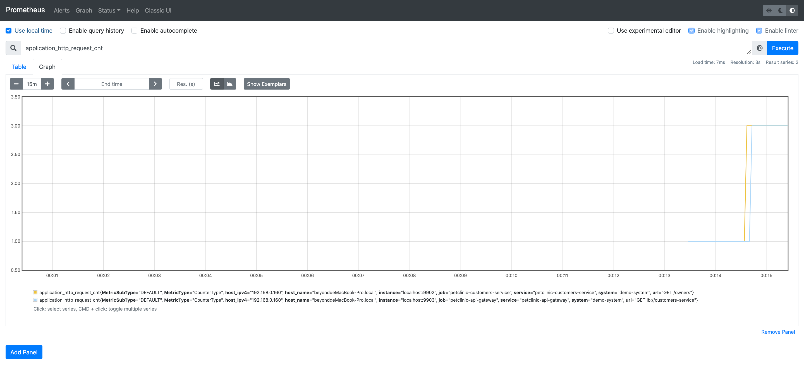

# Spring Petclinic Demo

You need Java 1.8+ and easeagent:

If you haven't `easeagent`, get it and set $EASE_AGENT_PATH: [EaseAgent](../README.md#get-and-set-environment-variable)

### Step 1
Building the demo application.
```
$ git clone https://github.com/akwei/spring-petclinic-microservices.git
$ cd spring-petclinic-microservices
$ mvn -DskipTests=true package
```

export EASE_AGENT_PATH=/Users/beyond/IdeaProjects/easeagent_dir/easeagent/build/target

### Step 2
Run the demo application with EaseAgent.
```
# Open another console
$ java -jar spring-petclinic-config-server/target/spring-petclinic-config-server-2.4.2.jar

# Open another console
$ java -jar spring-petclinic-discovery-server/target/spring-petclinic-discovery-server-2.4.2.jar

# Open another console
$ export EASE_AGENT_PATH=[Replace with agent path]
$ cp $EASE_AGENT_PATH/agent.properties $EASE_AGENT_PATH/vets-agent.properties
$ # vi $EASE_AGENT_PATH/vets-agent.properties replease name to "petclinic-vets-service"
$ java "-javaagent:${EASE_AGENT_PATH}/easeagent.jar" -Deaseagent.config.path=${EASE_AGENT_PATH}/vets-agent.properties -Deaseagent.server.port=9900 -jar spring-petclinic-vets-service/target/spring-petclinic-vets-service-2.4.2.jar

# Open another console
$ export EASE_AGENT_PATH=[Replace with agent path]
$ cp $EASE_AGENT_PATH/agent.properties $EASE_AGENT_PATH/visits-agent.properties
$ vi $EASE_AGENT_PATH/visits-agent.properties # replease name to "petclinic-visits-service"
$ java "-javaagent:${EASE_AGENT_PATH}/easeagent.jar" -Deaseagent.config.path=${EASE_AGENT_PATH}/visits-agent.properties -Deaseagent.server.port=9901 -jar spring-petclinic-visits-service/target/spring-petclinic-visits-service-2.4.2.jar

# Open another console
$ export EASE_AGENT_PATH=/[Replace with agent path]
$ cp $EASE_AGENT_PATH/agent.properties $EASE_AGENT_PATH/customers-agent.properties
$ vi $EASE_AGENT_PATH/customers-agent.properties # replease name to "petclinic-customers-service"
$ java "-javaagent:${EASE_AGENT_PATH}/easeagent.jar" -Deaseagent.config.path=${EASE_AGENT_PATH}/customers-agent.properties -Deaseagent.server.port=9902 -jar spring-petclinic-customers-service/target/spring-petclinic-customers-service-2.4.2.jar

# Open another console
$ export EASE_AGENT_PATH=[Replace with agent path]
$ cp $EASE_AGENT_PATH/agent.properties $EASE_AGENT_PATH/api-gateway-agent.properties
$ vi $EASE_AGENT_PATH/api-gateway-agent.properties # replease name to "petclinic-api-gateway"
$ java "-javaagent:${EASE_AGENT_PATH}/easeagent.jar" -Deaseagent.config.path=${EASE_AGENT_PATH}/api-gateway-agent.properties -Deaseagent.server.port=9903 -jar spring-petclinic-api-gateway/target/spring-petclinic-api-gateway-2.4.2.jar

```

### Step 3
Adding the following configuration in `prometheus.yml`
```
  - job_name: 'petclinic-vets-service'
    static_configs:
    - targets: ['localhost:9900']
    metrics_path: "/prometheus/metrics"

  - job_name: 'petclinic-visits-service'
    static_configs:
    - targets: ['localhost:9901']
    metrics_path: "/prometheus/metrics"

  - job_name: 'petclinic-customers-service'
    static_configs:
    - targets: ['localhost:9902']
    metrics_path: "/prometheus/metrics"

  - job_name: 'petclinic-api-gateway'
    static_configs:
    - targets: ['localhost:9903']
    metrics_path: "/prometheus/metrics"

```
Start Prometheus
```
$ ./prometheus --config.file=prometheus.yml
```

### Step 4
Open Browser to visit [http://localhost:8080](http://localhost:8080).

After visit more pages, open Prometheus manager [http://localhost:9090](http://localhost:9090), and search `application_http_request_cnt`. You will see as following.


