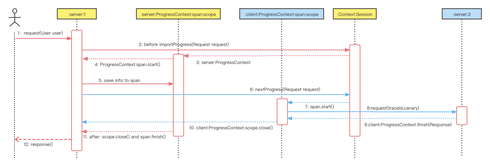
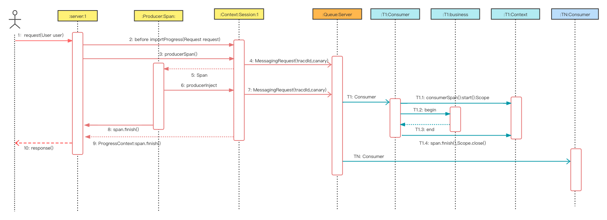
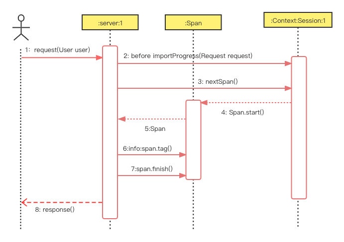

#  Tracing API

In Easeagent, Tracing is inspired by Dapper, using Zipkin as the implementation, but Dapper is only the basis of Tracing.

In order to be applicable to the business, we additionally encapsulate and define a dedicated interface.

These interfaces are related to the context, so we put all the newly defined interfaces together with the context.


According to the information transmission method, the Tracing interface is divided into four types:

1. Async: Thread asynchronous tracing interface
    

2. Progress: Tracing interface of the process
    

3. Data Queue: Tracing interface of data queue
    

4. Small Tracing
    

[com.megaease.easeagent.plugin.api.Context](../plugin-api/src/main/java/com/megaease/easeagent/plugin/api/Context.java)
```java
interface Context{
    //---------------------------------- 1. Async ------------------------------------------
    /**
     * Export a {@link AsyncContext} for asynchronous program processing
     * It will copy all the key:value in the current Context
     *
     * @return {@link AsyncContext}
     */
    AsyncContext exportAsync();

    /**
     * Import a {@link AsyncContext} for asynchronous program processing
     * It will copy all the key: value to the current Context
     * <p>
     * If you don’t want to get the Context, you can use the {@link AsyncContext#importToCurrent()} proxy call
     *
     * @param snapshot the AsyncContext from {@link #exportAsync()} called
     * @return {@link Scope} for tracing
     */
    Scope importAsync(AsyncContext snapshot);

    /**
     * Wraps the input so that it executes with the same context as now.
     */
    Runnable wrap(Runnable task);

    /**
     * Check task is wrapped.
     *
     * @param task Runnable
     * @return true if task is warpped.
     */
    boolean isWrapped(Runnable task);


    //----------------------------------2. Progress ------------------------------------------
    /**
     * Create a ProgressContext for Cross-process Trace link
     * It will pass multiple key:value values required by Trace and EaseAgent through
     * {@link Request#setHeader(String, String)}, And set the Span's kind, name and
     * cached scope through {@link Request#kind()}, {@link Request#name()} and {@link Request#cacheScope()}.
     * <p>
     * When you want to call the next program, you can pass the necessary key:value to the next program
     * by implementing {@link Request#setHeader(String, String)}, or you can get the {@link ProgressContext} of return,
     * call {@link ProgressContext#getHeaders()} to get it and pass it on.
     * <p>
     * It is usually called on the client when collaboration between multiple processes is required.
     * {@code client.nextProgress(Request.setHeader<spanId,root-source...>) --> server }
     * or
     * {@code client.nextProgress(Request).getHeaders<spanId,root-source...> --> server }
     *
     * @param request {@link Request}
     * @return {@link ProgressContext}
     */
    ProgressContext nextProgress(Request request);


    /**
     * Obtain key:value from the context passed by a parent program and create a ProgressContext
     * <p>
     * It will not only obtain the key:value required by Trace from the {@link Request#header(String)},
     * but also other necessary key:value of EaseAgent, such as the key configured in the configuration file:
     * {@link ProgressFields#EASEAGENT_PROGRESS_FORWARDED_HEADERS_CONFIG}
     * <p>
     * It will set the Span's kind, name and cached scope through {@link Request#kind()}, {@link Request#name()}
     * and {@link Request#cacheScope()}.
     * <p>
     * It is usually called on the server side when collaboration between multiple processes is required.
     * {@code client --> server.importProgress(Request<spanId,root-source...>) }
     *
     * @param request {@link Request}
     * @return {@link ProgressContext}
     */
    ProgressContext importProgress(Request request);


    //---------------------------------- 3. Data Queue ------------------------------------------
    /**
     * Obtain key:value from the message request and create a Span, Examples: kafka consumer, rabbitMq consumer
     * <p>
     * It will set the Span's kind, name and cached scope through {@link Request#kind()}, {@link Request#name()}
     * and {@link Request#cacheScope()}.
     *
     * <p>
     * It will set the Span's tags "messaging.operation", "messaging.channel_kind" and "messaging.channel_name" from request
     * {@link MessagingRequest#operation()} {@link MessagingRequest#channelKind()} {@link MessagingRequest#channelName()}
     *
     * <p>
     * It is usually called on the consumer.
     * {@code Kafka Server --> consumer.consumerSpan(Record<spanId,X-EG-Circuit-Breaker...>) }
     *
     * @param request {@link MessagingRequest}
     * @return {@link Span}
     */
    Span consumerSpan(MessagingRequest request);


    /**
     * Create a Span for message producer. Examples: kafka producer, rabbitMq producer
     * <p>
     * It will set the Span's tags "messaging.operation", "messaging.channel_kind", "messaging.channel_name" from request
     * {@link MessagingRequest#operation()} {@link MessagingRequest#channelKind()} {@link MessagingRequest#channelName()}
     * And set the Span's kind, name and cached scope through {@link Request#kind()}, {@link Request#name()} and
     * {@link Request#cacheScope()}.
     *
     * <p>
     * It will not only pass multiple key:value values required by Trace through {@link Request#setHeader(String, String)},
     * but also other necessary key:value of EaseAgent, such as the key configured in the configuration file:
     * {@link ProgressFields#EASEAGENT_PROGRESS_FORWARDED_HEADERS_CONFIG}
     * <p>
     * <p>
     * It is usually called on the producer.
     * {@code producer.producerSpan(Record) -- Record<spanId,root-source...> --> Message Server}
     *
     * @param request {@link MessagingRequest}
     * @return {@link Span}
     */
        Span producerSpan(MessagingRequest request);

    /**
     * Inject Consumer's Span key:value and Forwarded Headers to Request {@link MessagingRequest#setHeader(String, String)}.
     *
     * @param span    key:value from
     * @param request key:value to
     * @see Request#setHeader(String, String)
     */
    void consumerInject(Span span, MessagingRequest request);

    /**
     * Inject Producer's Span and Forwarded Headers key:value to Request {@link MessagingRequest#setHeader(String, String)}.
     *
     * @param span    key:value from
     * @param request key:value to
     * @see Request#setHeader(String, String)
     */
    void producerInject(Span span, MessagingRequest request);


    //---------------------------------- 4. Small Tracing ------------------------------------------
    /**
     * Returns a new child span if there's a {@link Tracing#currentSpan()} or a new trace if there isn't.
     *
     * @return {@link Span}
     */
    Span nextSpan();
}
```

[com.megaease.easeagent.plugin.api.context.AsyncContext](../plugin-api/src/main/java/com/megaease/easeagent/plugin/api/context/AsyncContext.java)
```java
/**
 * An asynchronous thread snapshot context
 * code example:
 * <pre>{@code
 *  AsyncContext asyncContext = context.exportAsync();
 *  class Run implements Runnable{
 *      void run(){
 *          try (Scope scope = asyncContext.importToCurrent()) {
 *               //do something
 *               //or asyncContext.getTracer().nextSpan();
 *          }
 *      }
 *  }
 *  }</pre>
 */
public interface AsyncContext {
    /**
     * When true, do nothing and nothing is reported . However, this AsyncContext should
     * still be injected into outgoing requests. Use this flag to avoid performing expensive
     * computation.
     */
    boolean isNoop();


    /**
     * @return {@link Tracing}
     */
    Tracing getTracer();

    /**
     * @return current {@link Context} for session
     */
    Context getContext();

    /**
     * Import this AsyncContext to current {@link Context} and return a {@link Scope}
     *
     * @return {@link Scope}
     */
    Scope importToCurrent();

    /**
     * @return all async snapshot context key:value
     */
    Map<Object, Object> getAll();


    /**
     * put all key:value to context
     *
     * @param context key:value
     */
    void putAll(Map<Object, Object> context);

}
```

[com.megaease.easeagent.plugin.api.context.ProgressContext](../plugin-api/src/main/java/com/megaease/easeagent/plugin/api/context/ProgressContext.java)
```java
/**
 * A cross-process data context, including tracing and Forwarded Headers
 */
public interface ProgressContext extends Setter {
    /**
     * When true, do nothing and nothing is reported . However, this ProgressContext should
     * still be injected into outgoing requests. Use this flag to avoid performing expensive
     * computation.
     */
    boolean isNoop();

    /**
     * @return {@link Span} for next progress client span
     */
    Span span();

    /**
     * @return {@link Scope} for current Span
     */
    Scope scope();

    /**
     * set header for next progress
     *
     * @param name  of header
     * @param value of header
     */
    void setHeader(String name, String value);

    /**
     * @return headers from the progress data context
     */
    Map<String, String> getHeaders();

    /**
     * Convert ProgressContext into AsyncContext and return
     *
     * @return {@link AsyncContext} for async
     */
    AsyncContext async();

    /**
     * @return current {@link Context} for session
     */
    Context getContext();

    /**
     * finish the progress span and save tag from {@link Response#header(String)}
     *
     * @param response {@link Response}
     */
    void finish(Response response);
}

```

## Span

In a Tracing, each node is a Span, here we also encapsulate the Span.

According to the agreement, we still abide by Dapper

* [com.megaease.easeagent.plugin.api.trace.Span](../plugin-api/src/main/java/com/megaease/easeagent/plugin/api/trace/Span.java)

## Other

In cross-process information transmission, there is the concept of request and response. Here we also encapsulate to facilitate the transfer and extraction of data.

1. We define two interfaces in cross-process

    * [com.megaease.easeagent.plugin.api.trace.Request](../plugin-api/src/main/java/com/megaease/easeagent/plugin/api/trace/Request.java)
    * [com.megaease.easeagent.plugin.api.trace.Response](../plugin-api/src/main/java/com/megaease/easeagent/plugin/api/trace/Response.java)

2. We define a interface in data queue

    * [com.megaease.easeagent.plugin.api.trace.MessagingRequest](../plugin-api/src/main/java/com/megaease/easeagent/plugin/api/trace/MessagingRequest.java)

