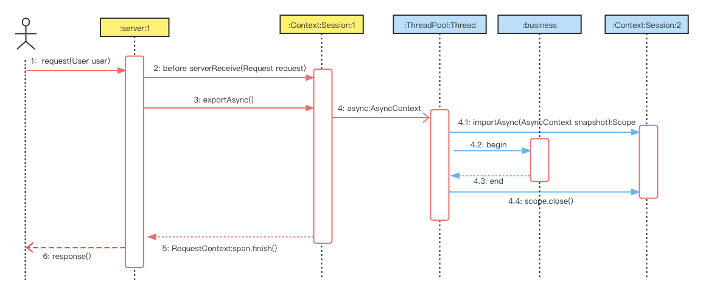
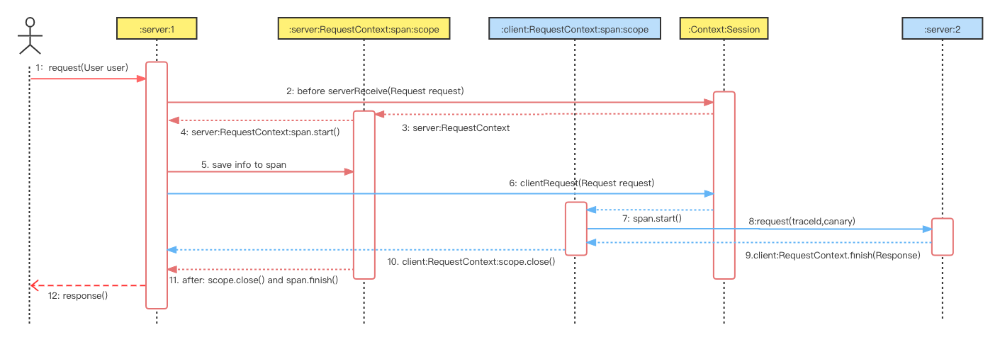
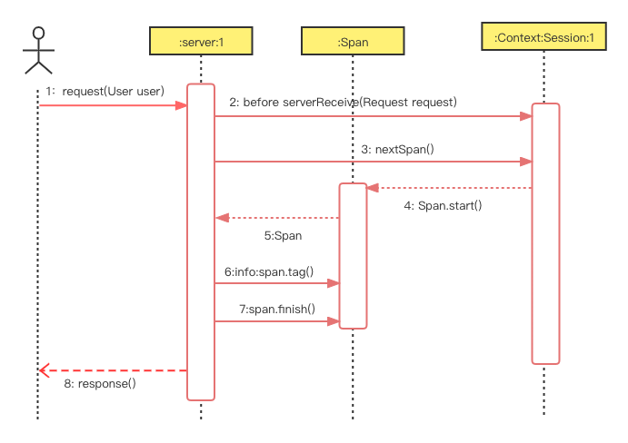

#  Tracing API

In Easeagent, Tracing is inspired by Dapper, using Zipkin as the implementation, but Dapper is only the basis of Tracing.

In order to be applicable to the business, we additionally encapsulate and define a dedicated interface.

These interfaces are related to the context, so we put all the newly defined interfaces together with the context.


According to the information transmission method, the Tracing interface is divided into four types:

1. Cross-thread Tracing: async

    

2. Cross-server Tracing: Server And Client

    

3. Message Tracing: Producer and Consumer

    

4. Span

    


[com.megaease.easeagent.plugin.api.Context](../plugin-api/src/main/java/com/megaease/easeagent/plugin/api/Context.java)

```java
interface Context{
    //---------------------------------- 1. Cross-thread ------------------------------------------
    // When you import and export the AsyncContext, you will also import and export the Tracing context for Thread.
    // go to Context, see : 
    //     AsyncContext exportAsync(); 
    //     Cleaner importAsync(AsyncContext snapshot);
    //     Runnable wrap(Runnable task); 
    //     boolean isWrapped(Runnable task);


    //----------------------------------2. Cross-server ------------------------------------------

    /**
     * Create a RequestContext for the next Server
     * It will pass multiple key:value values required by Trace and EaseAgent through
     * {@link Request#setHeader(String, String)}, And set the Span's kind, name and
     * cached scope through {@link Request#kind()}, {@link Request#name()} and {@link Request#cacheScope()}.
     * <p>
     * When you want to call the next Server, you can pass the necessary key:value to the next Server
     * by implementing {@link Request#setHeader(String, String)}, or you can get the {@link RequestContext} of return,
     * call {@link RequestContext#getHeaders()} to get it and pass it on.
     * <p>
     * It is usually called on the client request when collaboration between multiple server is required.
     * {@code client.clientRequest(Request.setHeader<spanId,root-source...>) --> server }
     * or
     * {@code client.clientRequest(Request).getHeaders<spanId,root-source...> --> server }
     * <p>
     * The Scope must be close after plugin:
     *
     * <pre>{@code
     *    void after(...){
     *       RequestContext rc = context.get(...)
     *       try{
     *
     *       }finally{
     *           rc.scope().close();
     *       }
     *    }
     * }</pre>
     *
     * @param request {@link Request}
     * @return {@link RequestContext}
     */
    RequestContext clientRequest(Request request);


    /**
     * Obtain key:value from the request passed by a parent Server and create a RequestContext
     * <p>
     * It will not only obtain the key:value required by Trace from the {@link Request#header(String)},
     * but also other necessary key:value of EaseAgent, such as the key configured in the configuration file:
     * {@link ProgressFields#EASEAGENT_PROGRESS_FORWARDED_HEADERS_CONFIG}
     * <p>
     * If there is no Tracing Header, it will create a Root Span
     * <p>
     * It will set the Span's kind, name and cached scope through {@link Request#kind()}, {@link Request#name()}
     * and {@link Request#cacheScope()}.
     * <p>
     * It is usually called on the server receives a request when collaboration between multiple server is required.
     * {@code client --> server.serverReceive(Request<spanId,root-source...>) }
     *
     * The Scope must be close after plugin:
     *
     * <pre>{@code
     *    void after(...){
     *       RequestContext rc = context.get(...)
     *       try{
     *
     *       }finally{
     *           rc.scope().close();
     *       }
     *    }
     * }</pre>
     *
     * @param request {@link Request}
     * @return {@link RequestContext}
     */
    RequestContext serverReceive(Request request);

    //---------------------------------- 3. Message Tracing ------------------------------------------
    /**
     * Obtain key:value from the message request and create a Span, Examples: kafka consumer, rabbitMq consumer
     * <p>
     * It will set the Span's kind, name and cached scope through {@link Request#kind()}, {@link Request#name()}
     * and {@link Request#cacheScope()}.
     *
     * <p>
     * It will set the Span's tags "messaging.operation", "messaging.channel_kind" and "messaging.channel_name" from request
     * {@link MessagingRequest#operation()} {@link MessagingRequest#channelKind()} {@link MessagingRequest#channelName()}
     *
     * <p>
     * It is usually called on the consumer.
     * {@code Kafka Server --> consumer.consumerSpan(Record<spanId,X-EG-Circuit-Breaker...>) }
     *
     * @param request {@link MessagingRequest}
     * @return {@link Span}
     */
    Span consumerSpan(MessagingRequest request);


    /**
     * Create a Span for message producer. Examples: kafka producer, rabbitMq producer
     * <p>
     * It will set the Span's tags "messaging.operation", "messaging.channel_kind", "messaging.channel_name" from request
     * {@link MessagingRequest#operation()} {@link MessagingRequest#channelKind()} {@link MessagingRequest#channelName()}
     * And set the Span's kind, name and cached scope through {@link Request#kind()}, {@link Request#name()} and
     * {@link Request#cacheScope()}.
     *
     * <p>
     * It will not only pass multiple key:value values required by Trace through {@link Request#setHeader(String, String)},
     * but also other necessary key:value of EaseAgent, such as the key configured in the configuration file:
     * {@link ProgressFields#EASEAGENT_PROGRESS_FORWARDED_HEADERS_CONFIG}
     * <p>
     * <p>
     * It is usually called on the producer.
     * {@code producer.producerSpan(Record) -- Record<spanId,root-source...> --> Message Server}
     *
     * @param request {@link MessagingRequest}
     * @return {@link Span}
     */
    Span producerSpan(MessagingRequest request);

    /**
     * Inject Consumer's Span key:value and Forwarded Headers to Request {@link MessagingRequest#setHeader(String, String)}.
     *
     * @param span    key:value from
     * @param request key:value to
     * @see Request#setHeader(String, String)
     */
    void consumerInject(Span span, MessagingRequest request);

    /**
     * Inject Producer's Span and Forwarded Headers key:value to Request {@link MessagingRequest#setHeader(String, String)}.
     *
     * @param span    key:value from
     * @param request key:value to
     * @see Request#setHeader(String, String)
     */
    void producerInject(Span span, MessagingRequest request);


    //---------------------------------- 4. Small Tracing ------------------------------------------
    /**
     * Returns a new child span if there's a {@link Tracing#currentSpan()} or a new trace if there isn't.
     *
     * @return {@link Span}
     */
    Span nextSpan();
}
```

[com.megaease.easeagent.plugin.api.context.RequestContext](../plugin-api/src/main/java/com/megaease/easeagent/plugin/api/context/RequestContext.java)
```java
/**
 * A cross-process data context, including tracing and Forwarded Headers
 * <p>
 * The Scope must be close after plugin:
 *
 * <pre>{@code
 *    void after(...){
 *       RequestContext rc = context.get(...)
 *       try{
 *
 *       }finally{
 *           rc.scope().close();
 *       }
 *    }
 * }</pre>
 */
public interface RequestContext extends Setter {
    /**
     * When true, do nothing and nothing is reported . However, this RequestContext should
     * still be injected into outgoing requests. Use this flag to avoid performing expensive
     * computation.
     */
    boolean isNoop();

    /**
     * @return {@link Span} for next progress client span
     */
    Span span();

    /**
     * The Scope must be close after plugin:
     *
     * <pre>{@code
     *    void after(...){
     *       RequestContext rc = context.get(...)
     *       try{
     *
     *       }finally{
     *           rc.scope().close();
     *       }
     *    }
     * }</pre>
     *
     * @return {@link Scope} for current Span
     */
    Scope scope();

    /**
     * set header for next progress
     *
     * @param name  of header
     * @param value of header
     */
    void setHeader(String name, String value);

    /**
     * @return headers from the progress data context
     */
    Map<String, String> getHeaders();

    /**
     * finish the progress span and save tag from {@link Response#header(String)}
     *
     * @param response {@link Response}
     */
    void finish(Response response);
}
```

## Tracing
The implementation of our Tracing Api and Tracing has been decoupled. For details, see:
* [com.megaease.easeagent.plugin.api.trace.ITracing](../plugin-api/src/main/java/com/megaease/easeagent/plugin/api/trace/ITracing.java)


## Span

In a Tracing, each node is a Span, here we also encapsulate the Span.

According to the agreement, we still abide by Dapper

* [com.megaease.easeagent.plugin.api.trace.Span](../plugin-api/src/main/java/com/megaease/easeagent/plugin/api/trace/Span.java)

## Other

In cross-process information transmission, there is the concept of request and response. Here we also encapsulate to facilitate the transfer and extraction of data.

1. We define two interfaces in cross-process

    * [com.megaease.easeagent.plugin.api.trace.Request](../plugin-api/src/main/java/com/megaease/easeagent/plugin/api/trace/Request.java)
    * [com.megaease.easeagent.plugin.api.trace.Response](../plugin-api/src/main/java/com/megaease/easeagent/plugin/api/trace/Response.java)

2. We define a interface in data queue

    * [com.megaease.easeagent.plugin.api.trace.MessagingRequest](../plugin-api/src/main/java/com/megaease/easeagent/plugin/api/trace/MessagingRequest.java)

